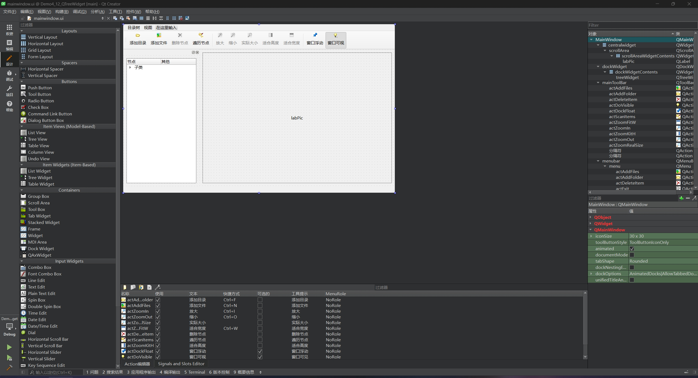
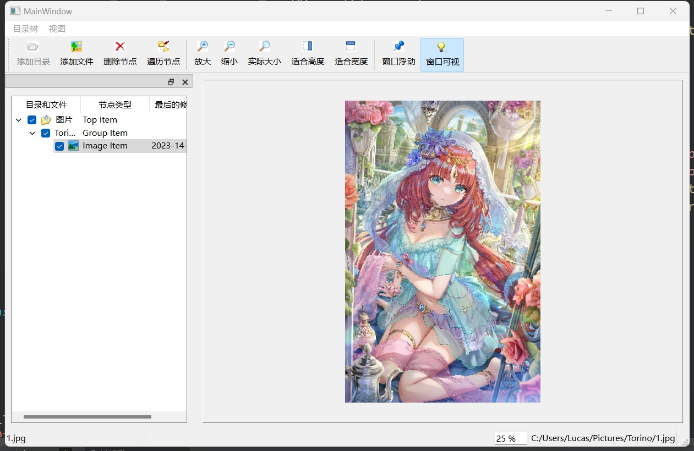
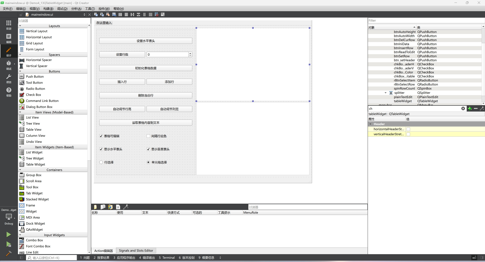
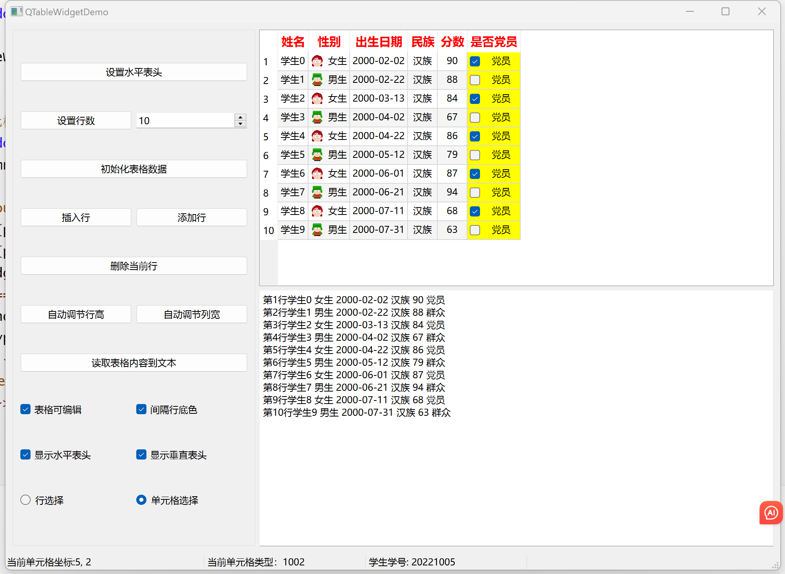

# 第七天

##  `QTreeWidget`案例

##### 本项目是制作一个图片查看器，支持从本地导入图片，并且允许操作文件管理；支持图片的放大、缩小和自适应

### UI部分



### 功能讲解

| 组件     | 功能                                            |
| -------- | ----------------------------------------------- |
| 添加目录 | 选中节点可以为当前节点添加子目录                |
| 添加文件 | 选中节点，可以为当前节点添加图片文件（jpg格式） |
| 删除节点 | 选中节点，可以删除，母节点除外                  |
| 遍历节点 | 遍历所有出现过的文件，并在名称旁边添加*         |
| 放大     | 图片以1.2的倍率放大                             |
| 缩小     | 图片以0.8的倍率缩小                             |
| 实际大小 | 显示图片的实际大小                              |
| 适合宽度 | 图片的宽度占满软件显示区域                      |
| 适合高度 | 图片的高度占满软件显示区域                      |
| 窗口浮动 | 文件控制面板单独从软件中分离开                  |
| 窗口可视 | 调整文件控制面板的显示                          |

### 代码部分

```c++
// 头文件部分
#ifndef MAINWINDOW_H
#define MAINWINDOW_H

#include <QMainWindow>

QT_BEGIN_NAMESPACE
namespace Ui {
class MainWindow;
}
QT_END_NAMESPACE

class QTreeWidgetItem;
class QLabel;
class QSpinBox;

class MainWindow : public QMainWindow
{
    Q_OBJECT

private:
    // 枚举类型，对于treeColNum这种确定的数字，使用枚举可以有效避免出现魔法数字，便于维护和管理
    enum treeColNum{colItem = 0, colItemType, colDate};
    enum treeItemType{itTopItem = 1001, itGroupItem, itImageItem};
    // 递归遍历函数
    void changeItemCaption(QTreeWidgetItem* item);
    // 工具栏显示文件名称
    QLabel* labFileName;
    QLabel* labNodeText;
    // 工具栏缩放比例控件
    QSpinBox* spinRatio;

    // 存储图片的变量
    QPixmap m_pixmap;
    // 图片的当前比例
    float m_ratio;
	// 图片显示函数
    void displayImage(QTreeWidgetItem* item);


public:
    MainWindow(QWidget *parent = nullptr);
    ~MainWindow();

private slots:
    void on_actAddFolder_triggered();

    void on_actAddFiles_triggered();

    void on_actDeleteItem_triggered();

    void on_treeWidget_currentItemChanged(QTreeWidgetItem *current, QTreeWidgetItem *previous);

    void on_actScanItems_triggered();

    void on_actZoomFitW_triggered();

    void on_actZoomKitH_triggered();

    void on_actZoomRealSize_triggered();

    void on_actZoomIn_triggered();

    void on_actZoomOut_triggered();

    void on_actDoVisible_triggered();

    void on_actDoVisible_triggered(bool checked);

    void on_actDockFloat_triggered(bool checked);

    void on_dockWidget_visibilityChanged(bool visible);

    void on_dockWidget_topLevelChanged(bool topLevel);

private:
    Ui::MainWindow *ui;
};
#endif // MAINWINDOW_H

```

```c++
// MainWindow.cpp部分
#include "mainwindow.h"
#include "ui_mainwindow.h"
#include<QDialog>
#include<QFileDialog>
#include <QSpinBox>

// 递归调用函数
void MainWindow::changeItemCaption(QTreeWidgetItem *item)
{
    // 给遍历的当前节点的文件名开头添加*
    QString str = "*" + item->text(colItem);
    item->setText(colItem, str);
    // 如果当前节点的子节点数量大于0，调用此函数，遍历他的每个子节点
    if(item->childCount() > 0)
        for(int i = 0; i < item->childCount(); i++){
            changeItemCaption(item->child(i));
        }
}

// 图片显示函数，传入用户当前选择的图片节点
void MainWindow::displayImage(QTreeWidgetItem *item)
{
    // 从传入的树节点 item 中获取存储在 Qt::UserRole 角色中的文件路径，并将其转换为字符串。
    QString fileName = item->data(colItem, Qt::UserRole).toString();
    // 更新他们的名称
    labFileName->setText(fileName);
    labNodeText->setText(item->text(colItem));
    // 使用m_pixmap加载图片，m_pixmap会存储当前显示的图片
    m_pixmap.load(fileName);
    // 调用图片宽度适应函数
    ui->actZoomKitH->triggered();

    // 其他有关图像操作的组件均可使用
    ui->actZoomKitH->setEnabled(true);
    ui->actZoomFitW->setEnabled(true);
    ui->actZoomIn->setEnabled(true);
    ui->actZoomOut->setEnabled(true);
    ui->actZoomRealSize->setEnabled(true);
}

MainWindow::MainWindow(QWidget *parent)
    : QMainWindow(parent)
    , ui(new Ui::MainWindow)
{
    ui->setupUi(this);
    // 清除treeWidget控件，释放内存
    ui->treeWidget->clear();

    // 设置QTreeWidgetItem的表头字段名
    QTreeWidgetItem* header = new QTreeWidgetItem();
    header->setText(colItem, "目录和文件");
    header->setText(colItemType, "节点类型");
    header->setText(colDate, "最后的修改日期");

    // 设置字体对齐方式（竖直和垂直方向居中对齐）
    header->setTextAlignment(colItem, Qt::AlignHCenter | Qt::AlignVCenter);
    header->setTextAlignment(colItemType, Qt::AlignHCenter | Qt::AlignVCenter);
    header->setTextAlignment(colDate, Qt::AlignHCenter | Qt::AlignVCenter);

    // 将设置好的参数作为treeWidget的表头名
    ui->treeWidget->setHeaderItem(header);

    // 添加一个根节点
    QIcon icon(":/images/icons/15.ico");
    QTreeWidgetItem* topItem = new QTreeWidgetItem(itTopItem);
    topItem->setIcon(colItem, icon);
    topItem->setText(colItem, "图片");
    topItem->setText(colItemType, "Top Item");
    topItem->setFlags(Qt::ItemIsSelectable | Qt::ItemIsUserCheckable | Qt::ItemIsEnabled | Qt::ItemIsAutoTristate);
    topItem->setCheckState(colItem, Qt::Checked);
    ui->treeWidget->addTopLevelItem(topItem);

    // 底部工具栏
    labNodeText = new QLabel("节点标题", this);
    // 设置最小宽度为200px
    labNodeText->setMinimumWidth(200);
    ui->statusbar->addWidget(labNodeText);
	
    // 设置缩放比例控件
    spinRatio = new QSpinBox(this);
    // 设置范围
    spinRatio->setRange(0, 2000);
    // 设置默认值
    spinRatio->setValue(100);
    // 设置后缀为 " %"
    spinRatio->setSuffix(" %");
    // 设置用户可读，但不可编辑
    spinRatio->setReadOnly(true);
    // 隐藏控件的增减按钮
    spinRatio->setButtonSymbols(QAbstractSpinBox::NoButtons);
    // 添加到状态栏上，并设置为永久显示的控件
    ui->statusbar->addPermanentWidget(spinRatio);

    labFileName = new QLabel("文件名", this);
    ui->statusbar->addPermanentWidget(labFileName);
}

MainWindow::~MainWindow()
{
    delete ui;
}

// 添加目录
void MainWindow::on_actAddFolder_triggered()
{
    // 弹出文件选择框，记录用户用户选择的文件夹名称
    QString dir = QFileDialog::getExistingDirectory();
    // 如果用户没选文件夹，程序不再进行
    if(dir.isEmpty()) return;
    // 获取用户当前选择的树状结构节点
    QTreeWidgetItem* parItem = ui->treeWidget->currentItem();
    // 若用户没有选择节点，程序不再进行
    if(parItem == nullptr) return;
	
    // 如果用户没有选择(itImageItem)图片，就允许添加目录
    // 毕竟图片是根节点，不能在根节点添加目录
    if(parItem->type() != itImageItem){
        int cnt = dir.length();
        // 得到最后一个/的位置
        int i = dir.lastIndexOf("/");
        // 通过一个小算法得到文件名
        QString nodeName = dir.right(cnt- i -1);
        // 创建一个新节点用于容纳文件夹
        QTreeWidgetItem* item = new QTreeWidgetItem();
        QIcon icon(":/images/icons/open3.bpm");
        // 注意colItem和colItemType是枚举的值
        // 给colItem列（第0列）的节点设置图标
        item->setIcon(colItem, icon);
        // 给colItem列（第0列）的节点设置字为nodeName(文件名)
        item->setText(colItem, nodeName);
        // colItemType（第1列）的节点设置字为Group Item
        item->setText(colItemType, "Group Item");
        // 设置节点的标志，使其可选择、可检查、可启用等
        item->setFlags(Qt::ItemIsSelectable | Qt::ItemIsUserCheckable | Qt::ItemIsEnabled | Qt::ItemIsAutoTristate);
        // 节点的检查状态为选中
        item->setCheckState(colItem, Qt::Checked);
        // 将文件夹路径存储在节点的用户角色数据中
        item->setData(colItem, Qt::UserRole, QVariant(dir));
        // 将新节点作为选中节点的子节点
        parItem->addChild(item);
    }
}

// 添加图片
void MainWindow::on_actAddFiles_triggered()
{
    // 打开一个文件选择框，选择框的标题是选择文件
    /**
    * QFileDialog::getOpenFileNames函数用法
    * QStringList QFileDialog::getOpenFileNames(QWidget *parent = nullptr, 
                                          const QString &caption = QString(), 
                                          const QString &dir = QString(), 
                                          const QString &filter = QString());
    * getOpenFileNames（打开窗口的位置， 对话框的标题， 默认打开目录， 文件过滤器（指定文件类））
    */
    QStringList files = QFileDialog::getOpenFileNames(this, "选择文件", "", "Images(*.jpg)");
    if(files.isEmpty()) return;
    QTreeWidgetItem *parItem, *item;
    // 获取当前选择的节点
    item = ui->treeWidget->currentItem();
    // 如果没有选择节点，默认选择顶层节点
    if(!item) item = ui->treeWidget->topLevelItem(0);
    
    /**
    * 这个判断条件的目的是，我们只允许在文件夹下面添加图片，也就是在parItem
    * 如果点击了图片节点，是不允许在图片节点下面添加节点的，所以只能在他的父节点添加，此时添加的节点与图片是同一节点
    * 反之就可以在当前节点下面添加新节点
    */
	// 如果当前节点是图片
    if(item->type() == itImageItem)
    	// 则将当前节点的父节点设置为parItem
        parItem = item->parent();
    else
        // 如果当前节点是文件夹，则设置自身为parItem
        parItem = item;

    // 处理用户选择的每个图片文件
    for(int i = 0; i < files.size(); i++){
        QString fileName = files.at(i);
        QIcon icon(":/images/icons/31.ico");
        // 获取文件的详细信息
        QFileInfo fileInfo(fileName);
        // 获取文件名
        QString NodeText = fileInfo.fileName();
        // 获取文件的最后修改时间
        QDateTime dateTime = fileInfo.lastModified();

		// 设置item类型为itImageItem
        QTreeWidgetItem* item = new QTreeWidgetItem(itImageItem);
        item->setIcon(colItem, icon);
        item->setText(colItem, NodeText);
        item->setText(colItemType, "Image Item");
        item->setText(colDate, dateTime.toString("yyyy-mm-dd"));
        item->setFlags(Qt::ItemIsSelectable | Qt::ItemIsUserCheckable | Qt::ItemIsEnabled | Qt::ItemIsAutoTristate);
        item->setCheckState(colItem, Qt::Checked);
        item->setData(colItem, Qt::UserRole, QVariant(fileName));
        parItem->addChild(item);
    }
    parItem->setExpanded(true);
}

// 删除节点
void MainWindow::on_actDeleteItem_triggered()
{
    QTreeWidgetItem* item = ui->treeWidget->currentItem();
    if(item == nullptr) return;
    QTreeWidgetItem* parItem = item->parent();
    // 通过父节点删除子节点，如果子节点是文件夹，它里面的所有文件均会被删除
    parItem->removeChild(item);
}

// 选中项的类型，启用或禁用一些操作（如添加文件夹、添加文件、删除项）以及在选择图像项时显示图像。
void MainWindow::on_treeWidget_currentItemChanged(QTreeWidgetItem *current, QTreeWidgetItem *previous)
{
    // 增加current == previous判断的目的是减少程序的开支，不用进行重复判断
    if(current == nullptr || current == previous) return;

    switch (current->type()) {
            // 如果选择顶层节点，不允许删除
    case itTopItem:
        ui->actAddFolder->setEnabled(true);
        ui->actAddFiles->setEnabled(true);
        ui->actDeleteItem->setEnabled(false);
        break;
            // 选中中间节点，所有操作均可做
    case itGroupItem:
        ui->actAddFolder->setEnabled(true);
        ui->actAddFiles->setEnabled(true);
        ui->actDeleteItem->setEnabled(true);
        break;
            // 选中图片节点，不允许增加节点，并且调用图片显示函数
    case itImageItem:
        ui->actAddFolder->setEnabled(false);
        ui->actAddFiles->setEnabled(true);
        ui->actDeleteItem->setEnabled(true);
        displayImage(current);
        break;
    }
}

// 调用递归遍历函数
void MainWindow::on_actScanItems_triggered()
{
    // ui->treeWidget->topLevelItemCount()是获取顶层节点的数量，并且传入当前节点，调用递归函数
    for(int i = 0; i < ui->treeWidget->topLevelItemCount(); i++){
        changeItemCaption(ui->treeWidget->topLevelItem(i));
    }
}

// 图片自适应宽度
void MainWindow::on_actZoomFitW_triggered()
{
    // 获取scrollArea的宽度，并减去30px
    int w = ui->scrollArea->width() - 30;
    // 获取图片的真实宽度
    int realw = m_pixmap.width();
    // 缩放比例是软件界面的宽度除以图片真实宽度
    m_ratio = float(w) / realw;
	// 给spinRatio设置数值为比例*100
    spinRatio->setValue(m_ratio * 100);
    // 保持图片的宽高比，以w - 30为基准，得到新的图片对象pix
    QPixmap pix = m_pixmap.scaledToWidth(w - 30);
    // 将pix显示在labPic中
    ui->labPic->setPixmap(pix);
}

// 图片自适应高度
void MainWindow::on_actZoomKitH_triggered()
{
    int h = ui->scrollArea->height() - 30;
    int realh = m_pixmap.height();
    m_ratio = float(h) / realh;

    spinRatio->setValue(m_ratio * 100);
    QPixmap pix = m_pixmap.scaledToHeight(h - 30);
    ui->labPic->setPixmap(pix);
}

// 展示图片的真实大小
void MainWindow::on_actZoomRealSize_triggered()
{
    ui->labPic->setPixmap(m_pixmap);
    m_ratio = 1;
    spinRatio->setValue(100);
}

// 放大
void MainWindow::on_actZoomIn_triggered()
{
    m_ratio *= 1.2;
    int w = m_ratio * m_pixmap.width();
    int h = m_ratio * m_pixmap.height();
    // 图片的大小为当前大小*相应的宽高缩放比
    ui->labPic->setPixmap(m_pixmap.scaled(w, h));
    spinRatio->setValue(100 * m_ratio);
}

// 缩小
void MainWindow::on_actZoomOut_triggered()
{
    m_ratio *= 0.8;
    int w = m_ratio * m_pixmap.width();
    int h = m_ratio * m_pixmap.height();
    ui->labPic->setPixmap(m_pixmap.scaled(w, h));
    spinRatio->setValue(100 * m_ratio);
}


void MainWindow::on_actDoVisible_triggered(bool checked)
{
    ui->dockWidget->setVisible(checked);
}


void MainWindow::on_actDockFloat_triggered(bool checked)
{
    ui->dockWidget->setFloating(checked);
}


void MainWindow::on_dockWidget_visibilityChanged(bool visible)
{
    ui->actDoVisible->setChecked(visible);
}


void MainWindow::on_dockWidget_topLevelChanged(bool topLevel)
{
    ui->actDockFloat->setEnabled(topLevel);
}


```

##### 软件界面



---


## `QTableWidget`案例

##### 本项目用于学习和掌握Qt表格组件的常用功能和方法

### UI部分



### 功能讲解

| 组件               | 功能                                 |
| ------------------ | ------------------------------------ |
| 设置水平表头       | 生成表头字段                         |
| 设置行数           | 根据右侧的计数器生成相应的行数       |
| 初始化表格数据     | 根据行数，自动生成相应行数的数据     |
| 插入行             | 选中当前行，在当前行插入新的一行     |
| 添加行             | 在表格末尾添加新的一行               |
| 删除当前行         | 选中当前行，删除选中的行             |
| 自动调整行高       | 根据当前行数调整每一行的行高         |
| 自动调整列宽       | 根据当前列数调整每一列的宽           |
| 读取表格数据到文本 | 将表格的所有数据显示在下方的文本框中 |
| 表格可编辑         | 每一个单元格的数据用户可编辑         |
| 间隔行底色         | 每相邻两行单元格的颜色不同，便于区分 |
| 显示水平表头       | 显示表头字段名                       |
| 显示垂直表头       | 显示最左边垂直表头字段名             |
| 行选择、单元格选择 | 用户选择每一行还是具体某个单元格     |

### 代码讲解

```c++
// mainwindow.h

#ifndef MAINWINDOW_H
#define MAINWINDOW_H

#include <QMainWindow>

QT_BEGIN_NAMESPACE
class QLabel;
namespace Ui {
class MainWindow;
}
QT_END_NAMESPACE

class MainWindow : public QMainWindow
{
    Q_OBJECT

    enum FieldColNum {colName = 0, colSex, colBirth, colNation, colScore, colParty};	// 枚举每一行显示的数据，避免魔法常量
    enum CellType {ctName = 1000, ctSex, ctBirth, ctNation, ctParty, ctScore};	// 	枚举每一行数据的数据类型
    QLabel *labCellIndex;	// 全局变量单元格的索引
    QLabel *labCellType;	// 全局变量单元格数据的数据类型
    QLabel *labStuId;	// 全局变量当前行的学生学号

public:
    MainWindow(QWidget *parent = nullptr);
    ~MainWindow();

private slots:
    void on_btn_setHeader_clicked();

    void on_btnSetRow_clicked();

    void on_btnIniData_clicked();

    void on_btnInsertRow_clicked();

    void on_btnAddRow_clicked();

    void on_btnDelCurRow_clicked();

    void on_btnAutoHeight_clicked();

    void on_btnAutoWidth_clicked();

    void on_btnReadToEdit_clicked();

    void on_chkBoxTabEditable_clicked(bool checked);

    void on_chkBoxRowColor_clicked(bool checked);

    void on_chkBoxHeaderH_clicked(bool checked);

    void on_chkBoxHeaderV_clicked(bool checked);

    void on_rBtnSelectRow_clicked();

    void on_rBtnSelectItem_clicked();

    void on_tableWidget_currentCellChanged(int currentRow, int currentColumn, int previousRow, int previousColumn);

private:
    Ui::MainWindow *ui;

private:
    void createItemRow(int rowNo, QString name, QString sex, QDate birth, QString nation, bool isPM, int score);	// 添加一行数据
};
#endif // MAINWINDOW_H

```

```c++
// mainwindow.cpp

#include "mainwindow.h"
#include "ui_mainwindow.h"
#include <QRandomGenerator>
#include <QDate>
#include <QLabel>

MainWindow::MainWindow(QWidget *parent)
    : QMainWindow(parent)
    , ui(new Ui::MainWindow)
{
    ui->setupUi(this);
    labCellIndex = new QLabel("当前单元格坐标:", this);
    labCellIndex->setMinimumWidth(250);
    labCellType = new QLabel("当前单元格类型:", this);
    labCellType->setMinimumWidth(200);
    labStuId = new QLabel("学生Id:",this);
    labStuId->setMinimumWidth(200);

    // 状态栏添加三个组件
    ui->statusbar->addWidget(labCellIndex);
    ui->statusbar->addWidget(labCellType);
    ui->statusbar->addWidget(labStuId);
}

MainWindow::~MainWindow()
{
    delete ui;
}

// 设置表格表头字段名
void MainWindow::on_btn_setHeader_clicked()
{
    ui->spinRowCount->clear();
    QStringList headerText;
    headerText<<"姓名"<<"性别"<<"出生日期"<<"民族"<<"分数"<<"是否党员";
    ui->tableWidget->setColumnCount(headerText.size());
    // ui->tableWidget->setHorizontalHeaderLabels(headerText);

    for(int i = 0; i < ui->tableWidget->columnCount(); i++){
        QTableWidgetItem *headerItem = new QTableWidgetItem(headerText.at(i));
        QFont font = headerItem->font();
        font.setBold(true);
        font.setPointSize(11);
        headerItem->setFont(font);
        headerItem->setForeground(QBrush(Qt::red));	// 表头背景为红色
        /**
        * 设置表头元素
        * setHorizontalHeaderItem(int column, QTableWidgetItem *item)
        */
        ui->tableWidget->setHorizontalHeaderItem(i, headerItem);
    }
}

// 设置表格行数
void MainWindow::on_btnSetRow_clicked()
{
    ui->tableWidget->setRowCount(ui->spinRowCount->value());	// 行数为spinRowCount的值
}

// 初始化表格数据
void MainWindow::on_btnIniData_clicked()
{
    ui->tableWidget->clearContents();	// 清空表格数据
    QDate birth(2000, 2, 2);
    for(int i = 0; i < ui->tableWidget->rowCount(); i++){
        QString strName = QString("学生%1").arg(i);
        QString strSex = (i % 2) ? "男生" : "女生";
        bool isParty = (i % 2) ? false : true;
        int score = QRandomGenerator::global()->bounded(60, 100);	// 60-100取随机数
        createItemRow(i, strName, strSex, birth, "汉族", isParty, score);
        birth = birth.addDays(20);	// 生日增加20天
    }
}

// 自定义函数，添加每一行的数据
void MainWindow::createItemRow(int rowNo, QString name, QString sex, QDate birth, QString nation, bool isPM, int score)
{
    uint stuID = 20221000;
    // 姓名
    QTableWidgetItem *item = new QTableWidgetItem(name, ctName);	// 第0列是姓名
    item->setTextAlignment(Qt::AlignHCenter | Qt::AlignVCenter);	// 水平居中对齐，竖直居中对齐
    stuID += rowNo;	
    item->setData(Qt::UserRole, QVariant(stuID));	// 将stuID的数据存入当前item，便于后期用户点击当前行获取stuID
    /**
    * 设置当前单元格的数据
    * setItem(int row, int column, QTableWidgetItem *item)
    */
    ui->tableWidget->setItem(rowNo, colName, item);
    
    // 性别
    QIcon icon;
    if(sex == "男生")
        icon.addFile(":/images/icons/boy.ico");
    else
        icon.addFile(":/images/icons/girl.ico");
    item = new QTableWidgetItem(sex, ctSex);
    item->setIcon(icon);
    item->setFlags(Qt::ItemIsSelectable | Qt::ItemIsEnabled);	// 单元格可选、可交互
    item->setTextAlignment(Qt::AlignHCenter | Qt::AlignVCenter);
    ui->tableWidget->setItem(rowNo, colSex, item);
    // 出生日期
    item = new QTableWidgetItem(birth.toString("yyyy-MM-dd"), ctBirth);	// 生日设置成规定的格式
    item->setTextAlignment(Qt::AlignHCenter | Qt::AlignVCenter);
    ui->tableWidget->setItem(rowNo, colBirth, item);
    // 民族
    item = new QTableWidgetItem(nation, ctNation);
    item->setTextAlignment(Qt::AlignHCenter | Qt::AlignVCenter);
    ui->tableWidget->setItem(rowNo, colNation, item);
    // 是否党员
    item = new QTableWidgetItem("党员", ctParty);
    item->setFlags(Qt::ItemIsSelectable | Qt::ItemIsEnabled | Qt::ItemIsUserCheckable);	// 用户可交互、可勾选
    item->setTextAlignment(Qt::AlignHCenter | Qt::AlignVCenter);
    if(isPM)
        item->setCheckState(Qt::Checked);
    else
        item->setCheckState(Qt::Unchecked);
    item->setBackground(QBrush(Qt::yellow));	// 党员单元格背景设置为黄色
    ui->tableWidget->setItem(rowNo, colParty, item);
    // 分数
    item = new QTableWidgetItem(QString::number(score), ctScore);
    item->setTextAlignment(Qt::AlignHCenter | Qt::AlignVCenter);
    ui->tableWidget->setItem(rowNo, colScore, item);
}

// 插入行
void MainWindow::on_btnInsertRow_clicked()
{
    int curRow = ui->tableWidget->currentRow();	// 获取用户选择的行
    ui->tableWidget->insertRow(curRow);	// 插入行
    createItemRow(curRow, "新学生", "男生", QDate::fromString("2000-1-1", "yyyy-M-d"), "汉族", false, 78);
}

// 表格末尾添加行
void MainWindow::on_btnAddRow_clicked()
{
    int curRow = ui->tableWidget->rowCount();	// 获取表格目前的行数
    ui->tableWidget->insertRow(curRow);	// 在最后一行插入
    createItemRow(curRow, "新学生", "女生", QDate::fromString("2000-1-1", "yyyy-M-d"), "汉族", true, 78);
}

// 删除当前行
void MainWindow::on_btnDelCurRow_clicked()
{
    int curRow = ui->tableWidget->currentRow();
    ui->tableWidget->removeRow(curRow);
}

// 自动调整单元格高度
void MainWindow::on_btnAutoHeight_clicked()
{
    ui->tableWidget->resizeRowsToContents();
}

// 自动调整单元格宽度
void MainWindow::on_btnAutoWidth_clicked()
{
    ui->tableWidget->resizeColumnsToContents();
}

// 将表格的数据显示到文本框中
void MainWindow::on_btnReadToEdit_clicked()
{
    ui->plainTextEdit->clear();
    QTableWidgetItem *item;
    for(int i = 0; i < ui->tableWidget->rowCount(); i++){
        QString str = QString::asprintf("第%d行: ", i + 1);
        for(int j = 0; j < ui->tableWidget->columnCount() - 1; j++){
            item = ui->tableWidget->item(i, j);
            str = str + item->text() + " ";	// 读取第i行j列的item的数值，将他拼接在str后面
        }

        item = ui->tableWidget->item(i, colParty);	// 党员这一栏单独设置
        if(item->checkState() == Qt::Checked)
            str += "党员";
        else
            str += "群众";
        ui->plainTextEdit->appendPlainText(str);	// 追加到文本的末尾
    }
}

// 设置表格文本可编辑
void MainWindow::on_chkBoxTabEditable_clicked(bool checked)
{
    if(checked)
        ui->tableWidget->setEditTriggers(QAbstractItemView::DoubleClicked | QAbstractItemView::SelectedClicked);	// 表格项在双击或者选中后点击时可以进行编辑
    else
        ui->tableWidget->setEditTriggers(QAbstractItemView::NoEditTriggers);
}

// 隔行交替颜色绘制背景
void MainWindow::on_chkBoxRowColor_clicked(bool checked)
{
    ui->tableWidget->setAlternatingRowColors(checked);
}

// 表头字段是否显示
void MainWindow::on_chkBoxHeaderH_clicked(bool checked)
{
    ui->tableWidget->horizontalHeader()->setVisible(checked);
}

// 每行字段是否显示
void MainWindow::on_chkBoxHeaderV_clicked(bool checked)
{
    ui->tableWidget->verticalHeader()->setVisible(checked);
}

// 选中当前行
void MainWindow::on_rBtnSelectRow_clicked()
{
    ui->tableWidget->setSelectionBehavior(QAbstractItemView::SelectRows);
}

// 选中当前单元格
void MainWindow::on_rBtnSelectItem_clicked()
{
    ui->tableWidget->setSelectionBehavior(QAbstractItemView::SelectItems);
}

// 点击不同单元格，底部状态栏显示相应数据
void MainWindow::on_tableWidget_currentCellChanged(int currentRow, int currentColumn, int previousRow, int previousColumn)
{
    // previousRow和previousColumn不会使用
    Q_UNUSED(previousRow);
    Q_UNUSED(previousColumn);
    QTableWidgetItem *item = ui->tableWidget->item(currentRow, currentColumn);
    if(item == nullptr) return;
    labCellIndex->setText(QString::asprintf("当前单元格坐标:%d, %d", currentRow, currentColumn));
    labCellType->setText(QString::asprintf("当前单元格类型：%d", item->type()));
    item = ui->tableWidget->item(currentRow, colName);
    // 获取UserRole的数据（学生id），并将他转换为UInt
    labStuId->setText(QString::asprintf("学生学号: %d", item->data(Qt::UserRole).toUInt()));
}


```

### 软件界面


