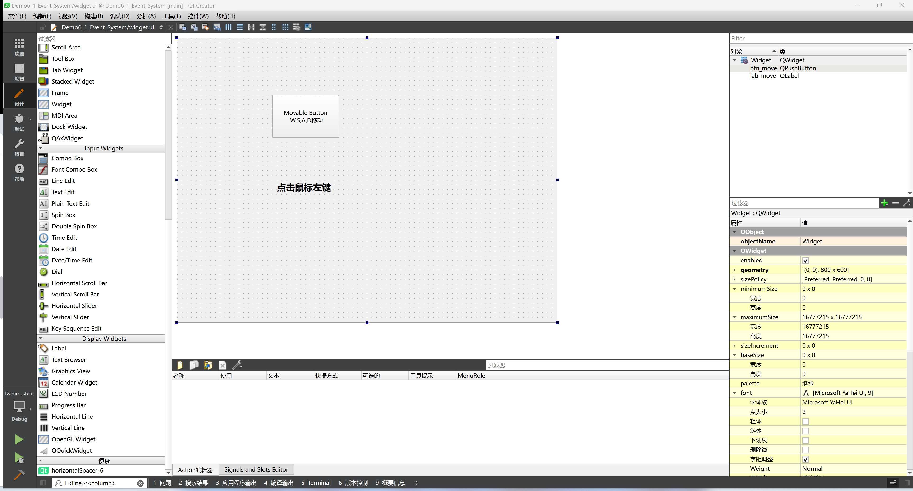
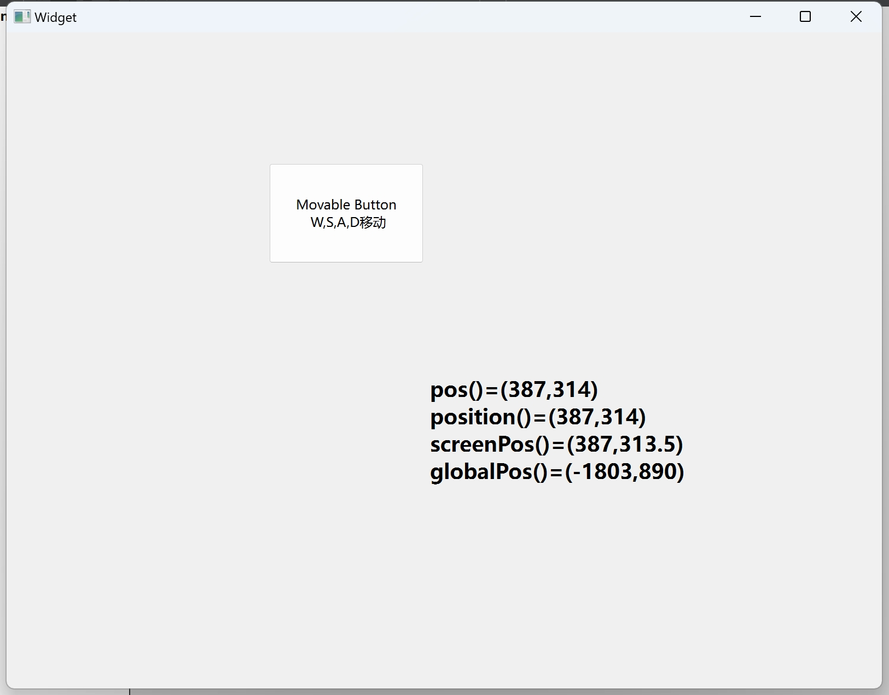
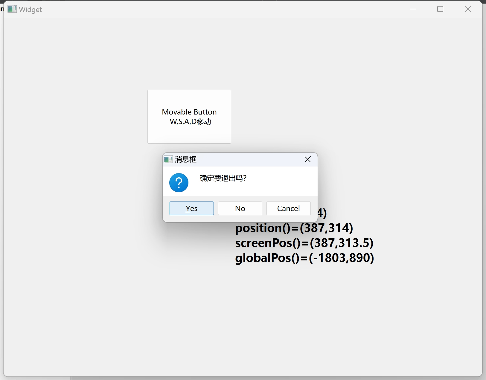
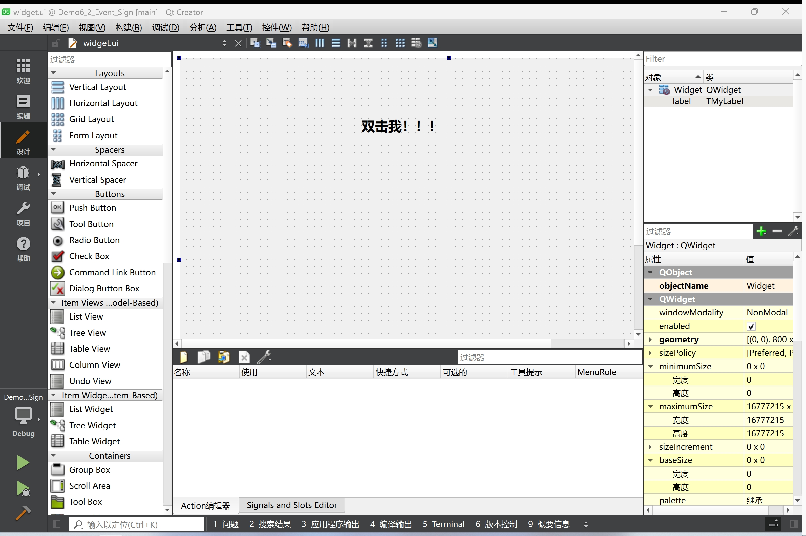
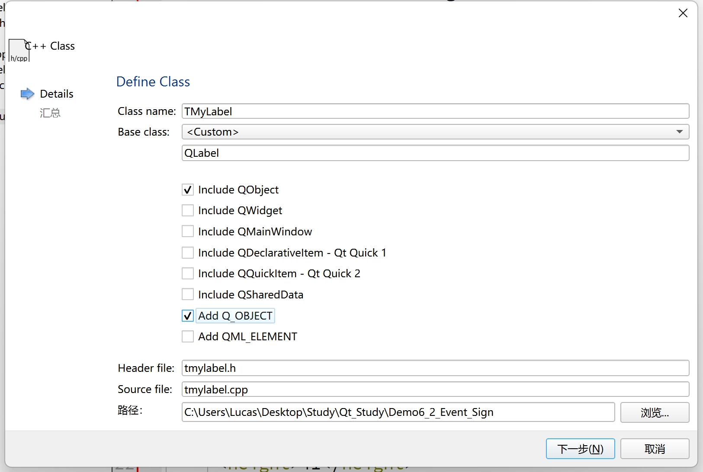
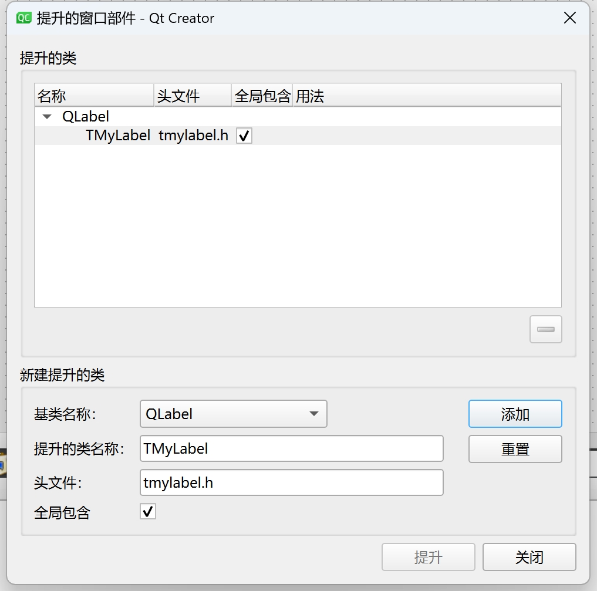
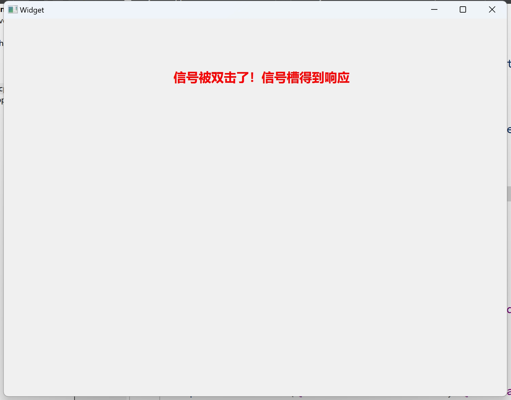

# 第九天

## `QFileSystemModel`

### 界面设计


### 代码部分

头文件没有什么好说的，主要就是定义了私有成员变量`m_model`

```c++
private:
    QFileSystemModel *m_model;
```

```c++
// mainwindow.cpp

#include "mainwindow.h"
#include "ui_mainwindow.h"
#include<QFileSystemModel>
#include<QFileDialog>

MainWindow::MainWindow(QWidget *parent)
    : QMainWindow(parent)
    , ui(new Ui::MainWindow)
{
    ui->setupUi(this);
    m_model = new QFileSystemModel(this);
        
    // ui中有三个数据，都使用同一个模型
    ui->treeView->setModel(m_model);
    ui->listView->setModel(m_model);
    ui->tableView->setModel(m_model);

        
    m_model->setRootPath(QDir::currentPath());	// 设置根节点，节点是用户当前选择的根节点，如果没选默认计算机的根节点
    // ui->treeView->setRootIndex(m_model->index(QDir::currentPath()));

    connect(ui->treeView, &QTreeView::clicked, ui->listView, &QListView::setRootIndex);	// 用户点击treeView，listView的根节点为treeView点击的目录
    connect(ui->treeView, &QTreeView::clicked, ui->tableView, &QTableView::setRootIndex);
}

MainWindow::~MainWindow()
{
    delete ui;
}

// 设置根目录
void MainWindow::on_actSetRoot_triggered()
{
    QString dir = QFileDialog::getExistingDirectory(this, "选择目录", QDir::currentPath());	// 获取用户选择的文件
    if(dir.isEmpty()) return;
    
    // 将选择的文件作为三个视图的根目录
    ui->treeView->setRootIndex(m_model->index(dir));
    ui->listView->setRootIndex(m_model->index(dir));
    ui->tableView->setRootIndex(m_model->index(dir));

}

// 显示目录和文件
void MainWindow::on_radioShowAll_clicked()
{
    ui->groupBoxFilter->setEnabled(true);
    m_model->setFilter(QDir::AllDirs | QDir::Files | QDir::NoDotAndDotDot);	// 显示模型里面所有类型的文件
}

// 只显示目录
void MainWindow::on_radioShowOnlyDir_clicked()
{
    ui->groupBoxFilter->setEnabled(false);	// groupBoxFilter里面不能操作
    m_model->setFilter(QDir::AllDirs | QDir::NoDotAndDotDot);	// 只显示文件夹，不显示隐藏的文件
}

// 文件过滤多选框
void MainWindow::on_checkBox_EnableFilter_clicked(bool checked)
{
    ui->comboFilters->setEnabled(checked);
    ui->btnApplyFilters->setEnabled(checked);
    m_model->setNameFilterDisables(!checked);	// 当复选框被选中时（checked为true），将模型的名称过滤器禁用状态设置为false
}

// 应用操作按钮
void MainWindow::on_btnApplyFilters_clicked()
{
    QStringList filter = ui->comboFilters->currentText().trimmed().split(";", Qt::SkipEmptyParts);	// 根据下拉菜单当前选项，将字符串进行分割，获取具体要过滤哪些文件
    // void QDir::setNameFilters(const QStringList &nameFilters)
    m_model->setNameFilters(filter);
}

// 当点击treeView是，底部状态栏更新
void MainWindow::on_treeView_clicked(const QModelIndex &index)
{
    ui->labFileName->setText(m_model->fileName(index));
    ui->labPath->setText(m_model->filePath(index));
    ui->labType->setText(m_model->type(index));
    ui->checkIsDir->setEnabled(m_model->isDir(index));

    int sz = m_model->size(index)/1024;	// 文件大小单位换算
    if(sz < 1024)
        ui->labFileSize->setText(QString("%1 KB").arg(sz));
    else
        ui->labFileSize->setText(QString::asprintf("%.1f", sz/1024.0));

}
```

### 最终效果


## 事件系统

### 界面设计



本案例主要是学习自定义事件，用户点击鼠标可以获取当前点击相对于窗口的坐标，绝对坐标以及全局坐标；用户也可以使用键盘的WASD按钮控制按钮的位置

### 代码部分

```c++
// widget.h

#ifndef WIDGET_H
#define WIDGET_H

#include <QWidget>

QT_BEGIN_NAMESPACE
namespace Ui {
class Widget;
}
QT_END_NAMESPACE

class Widget : public QWidget
{
    Q_OBJECT

public:
    Widget(QWidget *parent = nullptr);
    ~Widget();

private:
    Ui::Widget *ui;

    // QWidget interface
protected:
    virtual void mousePressEvent(QMouseEvent *event) override;	// 重构鼠标点击事件
    virtual void keyPressEvent(QKeyEvent *event) override;	// 重构键盘点击事件

    // QWidget interface
protected:
    virtual void paintEvent(QPaintEvent *event) override;	// 重构图片绘制事件

    // QWidget interface
protected:
    virtual void closeEvent(QCloseEvent *event) override;	// 重构关闭窗口事件
};


#endif // WIDGET_H

```

```c++
// widget.cpp

#include "widget.h"
#include "ui_widget.h"
#include <QPainter>
#include<QMouseEvent>
#include <QMessageBox>

Widget::Widget(QWidget *parent)
    : QWidget(parent)
    , ui(new Ui::Widget)
{
    ui->setupUi(this);

}

Widget::~Widget()
{
    delete ui;
}

// 鼠标点击事件
void Widget::mousePressEvent(QMouseEvent *event)
{
    if(event->button() != Qt::LeftButton)	// 如果鼠标点击的不是左键就退出函数
        return;
    QPoint pt = event->pos(); // 相对widget位置
    QPointF relaPt = event->position();	// 窗口相对位置
    QPointF winPt = event->scenePosition(); // 相对屏幕的绝对位置
    QPointF globPt = event->globalPos(); // 整个屏幕的位置
    QString str = QString("pos()=(%1,%2)").arg(pt.x()).arg(pt.y());
    str += QString("\nposition()=(%1,%2)").arg(relaPt.x()).arg(relaPt.y());
    str += QString("\nscreenPos()=(%1,%2)").arg(winPt.x()).arg(winPt.y());
    str += QString("\nglobalPos()=(%1,%2)").arg(globPt.x()).arg(globPt.y());
    ui->lab_move->setText(str);
    ui->lab_move->adjustSize();
    ui->lab_move->move(event->pos());	// 将label标签移到用户点击的位置
    QWidget::mousePressEvent(event);	// 调用此函数，当然其实也可以不写
}

// 键盘事件
void Widget::keyPressEvent(QKeyEvent *event)
{
    QPoint pt = ui->btn_move->pos();	// 获取button组件的位置
    
    // 当用户按下键盘上不同按键时，button向不同方向移动
    if((event->key() == Qt::Key_A) || (event->key() == Qt::Key_Left))
        ui->btn_move->move(pt.x() - 20, pt.y());
    if((event->key() == Qt::Key_D) || (event->key() == Qt::Key_Right))
        ui->btn_move->move(pt.x() + 20, pt.y());
    if((event->key() == Qt::Key_W) || (event->key() == Qt::Key_Up))
        ui->btn_move->move(pt.x(), pt.y() - 20);
    if((event->key() == Qt::Key_S) || (event->key() == Qt::Key_Down))
        ui->btn_move->move(pt.x(), pt.y() + 20);

    QWidget::keyPressEvent(event);
}

// 修改背景图片
void Widget::paintEvent(QPaintEvent *event)
{
    QPainter painter(this);
    // 设置图片的位置和文件
    painter.drawPixmap(0, 0, width(), this->height(), QPixmap("qrc:/icon/images/background.jpg"));
}

// 设置关闭窗口事件
void Widget::closeEvent(QCloseEvent *event)
{
    // 关闭程序时会出现弹窗，弹窗会有三个按钮
    QMessageBox::StandardButton result = QMessageBox::question(this, "消息框", "确定要退出吗？",
                                                               QMessageBox::Yes | QMessageBox::No| 																			QMessageBox::Cancel);
    
    // 如果用户选择YES，就接收事件（关闭程序）
    if(result == QMessageBox::Yes)
        event->accept();
    // 反之不接受
    else
        event->ignore();
}
```

### 最终效果





## 事件信号

### 界面设计



用户点击窗口任意位置都会让label标签变成“窗口被点击了”，双击label标签，字会变成“信号被双击了！信号槽得到相应”

### 代码部分

```c++
// widget.h

#ifndef WIDGET_H
#define WIDGET_H

#include <QWidget>
#include <QObject>

QT_BEGIN_NAMESPACE
namespace Ui {
class Widget;
}
QT_END_NAMESPACE

class Widget : public QWidget
{
    Q_OBJECT

public:
    Widget(QWidget *parent = nullptr);
    ~Widget();

private:
    void do_doubleClick();	// 自定义槽函数，用于处理双击事件

private:
    Ui::Widget *ui;

    // QWidget interface
protected:
    virtual void mouseDoubleClickEvent(QMouseEvent *event) override;	// 重构鼠标双击事件
};

#endif // WIDGET_H

```

```c++
// widget.cpp

#include "widget.h"
#include "ui_widget.h"
#include "tmylabel.h"

Widget::Widget(QWidget *parent)
    : QWidget(parent)
    , ui(new Ui::Widget)
{
    ui->setupUi(this);

    connect(ui->label, &TMyLabel::doubleClicked, this, &Widget::do_doubleClick); 	// 接收自定义信号，执行槽函数
}

Widget::~Widget()
{
    delete ui;
}

// 在窗口任意位置双击，label会改变文本
void Widget::mouseDoubleClickEvent(QMouseEvent *event)	
{
    Q_UNUSED(event);
    ui->label->setText("窗口被双击了");
    ui->label->adjustSize();
}

inline void Widget::do_doubleClick()
{
    ui->label->setText("信号被双击了！信号槽得到响应");
    ui->label->adjustSize();
}

```

我们没有专门用于点击标签的类，所以我们需要自定义一个类用于处理双击标签事件，`TMyLabel`类继承于`QLabel`



在设计师窗口右键label组件，选择提升窗口部件，添加自定义的类,让label可以使用我们自定义的类



右键`TMyLabel`重构，选择插入虚函数，重构`mouseDoubleClickEvent`事件

```c++
// tmylabel.h

#ifndef TMYLABEL_H
#define TMYLABEL_H

#include <QLabel>
#include <QObject>

class TMyLabel : public QLabel
{
    Q_OBJECT
public:
    TMyLabel(QWidget *parent = nullptr);

    // QWidget interface
protected:
    virtual void mouseDoubleClickEvent(QMouseEvent *event) override;

signals:
    void doubleClicked();	// 自定义信号

    // QObject interface
public:
    virtual bool event(QEvent *event) override;
};


#endif // TMYLABEL_H

```

```c++
// tmylabel.cpp

#include "tmylabel.h"
#include <QEvent>

TMyLabel::TMyLabel(QWidget *parent) : QLabel(parent) {
    setAttribute(Qt::WA_Hover, true);	// 用户的鼠标悬浮在label标签上时文本会变色
}

// 只要用户双击label标签就会发送doubleClicked信号
void TMyLabel::mouseDoubleClickEvent(QMouseEvent *event)
{
    Q_UNUSED(event);
    emit doubleClicked();
}

bool TMyLabel::event(QEvent *event)
{
    if(event->type() == QEvent::HoverEnter)	// 如果用户进入悬浮事件
    {
        QPalette plet = this->palette();
        plet.setColor(QPalette::WindowText, Qt::red);
        setPalette(plet);
    }
    else if(event->type() == QEvent::HoverLeave)	// 如果用户退出悬浮事件
    {	
        QPalette plet = this->palette();
        plet.setColor(QPalette::WindowText, Qt::black);
        setPalette(plet);
    }
    return QLabel::event(event);	// 返回是否触发事件
}

```

### 最终效果


