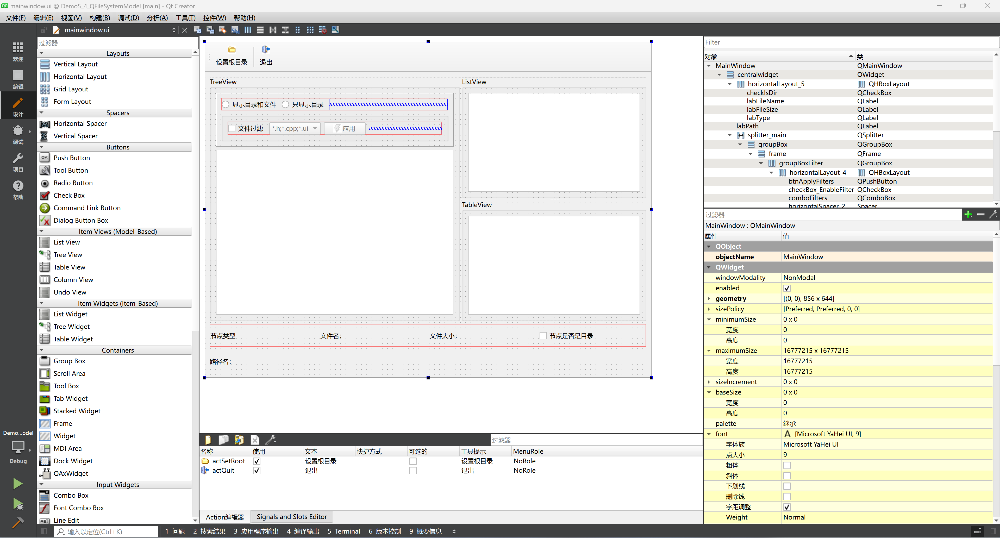
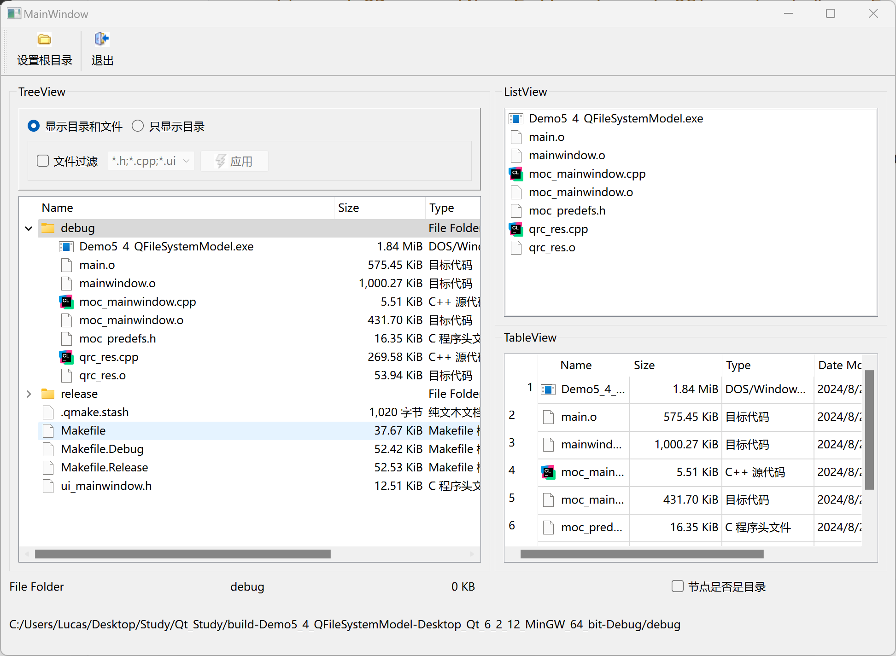

# 第九天

## `QFileSystemModel`

### 界面设计



### 代码部分

头文件没有什么好说的，主要就是定义了私有成员变量`m_model`

```c++
private:
    QFileSystemModel *m_model;
```

```c++
// mainwindow.cpp

#include "mainwindow.h"
#include "ui_mainwindow.h"
#include<QFileSystemModel>
#include<QFileDialog>

MainWindow::MainWindow(QWidget *parent)
    : QMainWindow(parent)
    , ui(new Ui::MainWindow)
{
    ui->setupUi(this);
    m_model = new QFileSystemModel(this);
        
    // ui中有三个数据，都使用同一个模型
    ui->treeView->setModel(m_model);
    ui->listView->setModel(m_model);
    ui->tableView->setModel(m_model);

        
    m_model->setRootPath(QDir::currentPath());	// 设置根节点，节点是用户当前选择的根节点，如果没选默认计算机的根节点
    // ui->treeView->setRootIndex(m_model->index(QDir::currentPath()));

    connect(ui->treeView, &QTreeView::clicked, ui->listView, &QListView::setRootIndex);	// 用户点击treeView，listView的根节点为treeView点击的目录
    connect(ui->treeView, &QTreeView::clicked, ui->tableView, &QTableView::setRootIndex);
}

MainWindow::~MainWindow()
{
    delete ui;
}

// 设置根目录
void MainWindow::on_actSetRoot_triggered()
{
    QString dir = QFileDialog::getExistingDirectory(this, "选择目录", QDir::currentPath());	// 获取用户选择的文件
    if(dir.isEmpty()) return;
    
    // 将选择的文件作为三个视图的根目录
    ui->treeView->setRootIndex(m_model->index(dir));
    ui->listView->setRootIndex(m_model->index(dir));
    ui->tableView->setRootIndex(m_model->index(dir));

}

// 显示目录和文件
void MainWindow::on_radioShowAll_clicked()
{
    ui->groupBoxFilter->setEnabled(true);
    m_model->setFilter(QDir::AllDirs | QDir::Files | QDir::NoDotAndDotDot);	// 显示模型里面所有类型的文件
}

// 只显示目录
void MainWindow::on_radioShowOnlyDir_clicked()
{
    ui->groupBoxFilter->setEnabled(false);	// groupBoxFilter里面不能操作
    m_model->setFilter(QDir::AllDirs | QDir::NoDotAndDotDot);	// 只显示文件夹，不显示隐藏的文件
}

// 文件过滤多选框
void MainWindow::on_checkBox_EnableFilter_clicked(bool checked)
{
    ui->comboFilters->setEnabled(checked);
    ui->btnApplyFilters->setEnabled(checked);
    m_model->setNameFilterDisables(!checked);	// 当复选框被选中时（checked为true），将模型的名称过滤器禁用状态设置为false
}

// 应用操作按钮
void MainWindow::on_btnApplyFilters_clicked()
{
    QStringList filter = ui->comboFilters->currentText().trimmed().split(";", Qt::SkipEmptyParts);	// 根据下拉菜单当前选项，将字符串进行分割，获取具体要过滤哪些文件
    // void QDir::setNameFilters(const QStringList &nameFilters)
    m_model->setNameFilters(filter);
}

// 当点击treeView是，底部状态栏更新
void MainWindow::on_treeView_clicked(const QModelIndex &index)
{
    ui->labFileName->setText(m_model->fileName(index));
    ui->labPath->setText(m_model->filePath(index));
    ui->labType->setText(m_model->type(index));
    ui->checkIsDir->setEnabled(m_model->isDir(index));

    int sz = m_model->size(index)/1024;	// 文件大小单位换算
    if(sz < 1024)
        ui->labFileSize->setText(QString("%1 KB").arg(sz));
    else
        ui->labFileSize->setText(QString::asprintf("%.1f", sz/1024.0));

}
```

### 最终效果


