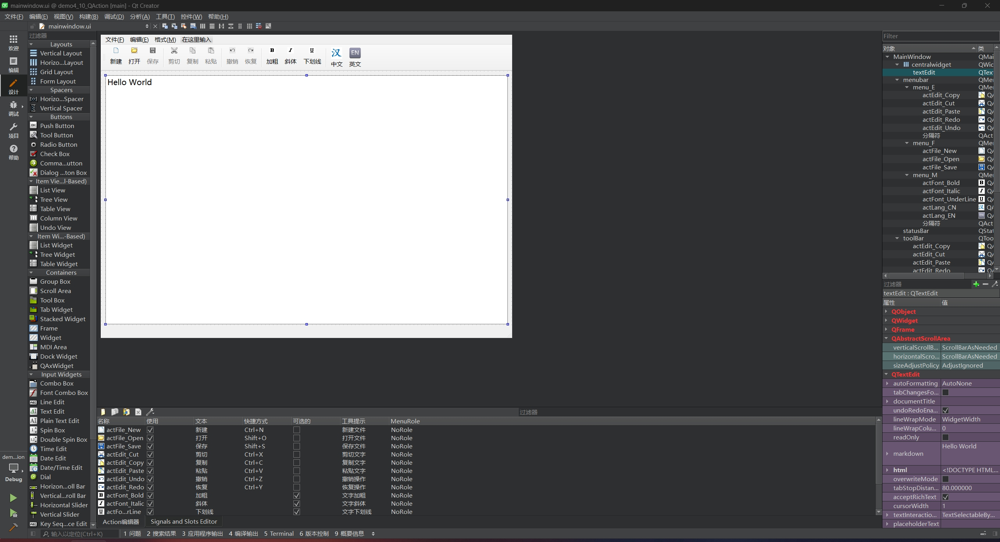
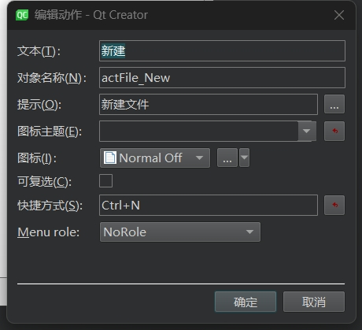
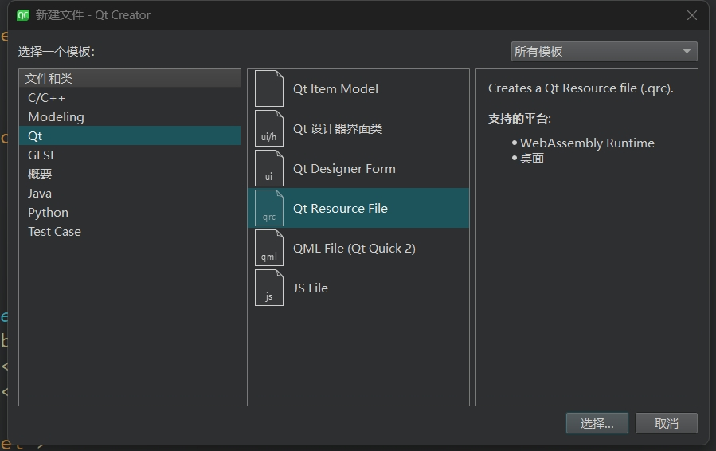
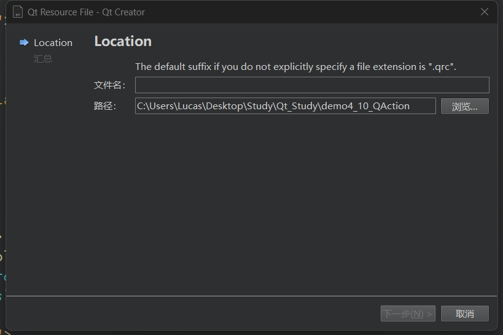
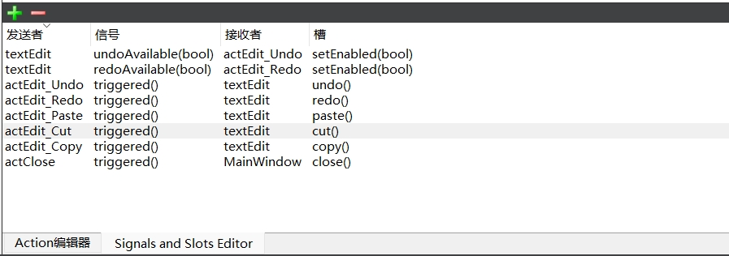
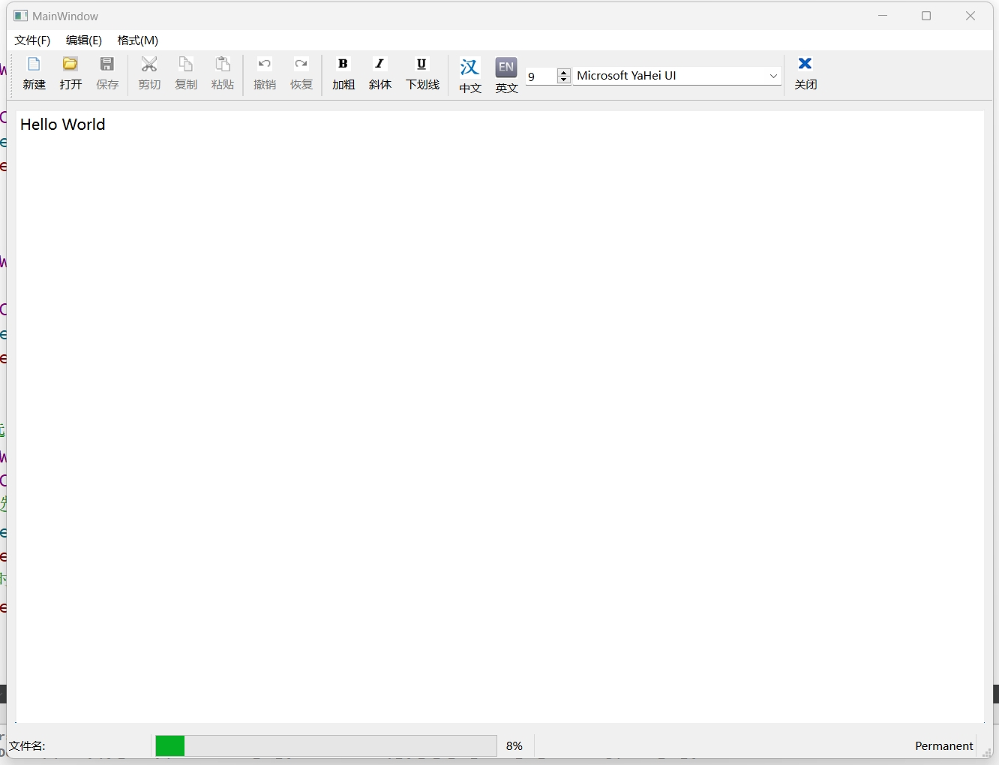

# 第五天

## QAction案例（简易文字编译器）

### Qt Designer制作部分



##### 窗口选择"QApplication"，目的是可以添加最上方的选择框，关于快捷键是“文字+&快捷键”，比如文件就是“文件&F”，这样用户就可以使用快捷键点开文件选项

### QAction编辑器


##### 用户可以选择添加QAction，注意，像UI上面的那些选项不是QPushButton，而是QAction,只需要将QAction拖入工具栏或者顶部栏就可以了

### QAction编辑动作



| 名称      | 作用                                 |
| --------- | ------------------------------------ |
| 文本      | 界面上显示的名字                     |
| 对象名称  | 代码中的对象名称，也就是变量名       |
| 提示      | 用户鼠标放在QAction上时的提示信息    |
| 图标主题  | 未知                                 |
| 图标      | 图标的Icon                           |
| 可复选    | QAction是否允许多选                  |
| 快捷方式  | 无需输入，只需要按对应的快捷键就可以 |
| Menu role | 未知                                 |

### 导入外部资源

##### 在Qt中很多时候我们需要导入图片作为Icon图标或者一些图片资源，文件栏选择new file -> Qt -> Qt Resource File -> 选择资源文件夹 -> 自动生成`qrc`文件





### 代码编写UI

##### 虽然这种拖拽组件的方式生成UI很方便，但是也有很多组件是无法用这种方式生成的，所以我们需要借助代码实现

```c++
	/**
    * 解决中英文界面互斥性
    * 中文和英文按钮虽然可以直接生成，但是这两个按钮并不能做到互斥
    * 我们将这两个QAction加入一个QActionGroup，让他们作为一个组，在组里面，通过setExclusive（true）设置为互斥性
    */
    QActionGroup *actionGroup = new QActionGroup(this);
    actionGroup->addAction(ui->actLang_CN);
    actionGroup->addAction(ui->actLang_EN);
    actionGroup->setExclusive(true);

    // 解决可视化UI无法解决的组件
    QSpinBox *spinFontSize = new QSpinBox(this);
	// 设置最小值
    spinFontSize->setMinimum(5);
	// 设置最大值
    spinFontSize->setMaximum(50);
	// 将spinFontSize的值设置为textEdit的文字大小
    spinFontSize->setValue(ui->textEdit->font().pointSize());
	// 设置spinFontSize的最短宽度
    spinFontSize->setMinimumWidth(50);
	// 把他添加到toolBar里
    ui->toolBar->addWidget(spinFontSize);

	// 	专门用于选择字体的选择框
    QFontComboBox* comboFontBox = new QFontComboBox(this);
    comboFontBox->setMinimumWidth(150);
	// 设置textEdit的字体样式
    comboFontBox->setFont(ui->textEdit->font());
    ui->toolBar->addWidget(comboFontBox);
	
	// 在工具栏此处添加分割线
    ui->toolBar->addSeparator();
	// 添加关闭按钮
    ui->toolBar->addAction(ui->actClose);

    // status bar（底部状态栏，不是工具栏！！！）
    labFile = new QLabel(this);
    labFile->setMinimumHeight(50);
    labFile->setText("文件名:");
    ui->statusBar->addWidget(labFile);
	// 添加进度条
    progressBar = new QProgressBar(this);
    progressBar->setMaximum(50);
    progressBar->setMinimum(5);
	// 进度条的当前数值为textEdit的字体大小
    progressBar->setValue(ui->textEdit->font().pointSize());
    ui->statusBar->addWidget(progressBar);
    labInfo = new QLabel("Permanent");
	// 将labInfo设置为状态栏中永久添加给定的窗口小控件
    ui->statusBar->addPermanentWidget(labInfo);
```

### 添加槽函数

##### 有部分组件可以直接在UI界面编辑信号

##### 这里讲解几个信号

- 信号的发送者是textEdit，一旦textEdit的文本内容发生改变，他将会给actEdit_Undo发送undoAvaible(true),并执行setEnabled槽函数，此时文本框和撤销按钮就有了联系，在对actEdit_Undo添加信号和槽函数就能实现文字的撤销操作
- 信号的发送者是textEdit，一旦用户进行了合适的操作（比如撤销或删除），他将会给actEdit_Redo发送redoAvaible(true),并执行setEnabled槽函数，此时文本框和恢复按钮就有了联系，在对actEdit_Redo添加信号和槽函数就能实现文字的恢复操作




##### 在UI界面对QAction点击转到槽函数，程序将会自动生成相应的槽函数，只需要编写相应的代码就可以了

```c++
void MainWindow::on_actFile_New_triggered()
{
    // 清空文本框的内容
    ui->textEdit->clear();
    // 检测文本框的内容变化，并设置为当前内容未被修改
    ui->textEdit->document()->setModified(false);
    // 注意这里的labFile用多个组件会使用，所以要把他设置为全局变量
    labFile->setText("新创建的文件");
}


void MainWindow::on_actFile_Open_triggered()
{
    labFile->setText("正在打开文件");
}


void MainWindow::on_actFile_Save_triggered()
{
    ui->textEdit->document()->setModified(false);
    labFile->setText("文件已保存");
}

// 这个函数的作用就跟上面的撤销恢复操作一样
// 当选中文本的时候，就会给三个组件发送setEnabled的信号，告诉他们可以执行赋值和剪切的操作
// 粘贴操作比较特殊，它是通过canPaste()函数返回bool值，如果剪贴板中有内容就可以执行粘贴操作，反之不能
void MainWindow::on_textEdit_copyAvailable(bool b)
{
    ui->actEdit_Copy->setEnabled(b);
    ui->actEdit_Cut->setEnabled(b);
    ui->actEdit_Paste->setEnabled(ui->textEdit->canPaste());
}


// 当文本选择发生变化时(例如用户选中或取消选中一段文本)，textEdit会发送selectionChanged信号，并调用这个函数
// 这个函数的作用是更新用户界面中的操作按钮或菜单项的状态。例如，如果当前选中文本是加粗的，
// ui->actFont_Bold->setChecked(true) 会使“加粗”按钮呈选中状态
void MainWindow::on_textEdit_selectionChanged()
{
    // 获取当前选中文本的字符格式，返回一个 QTextCharFormat 对象。该对象包含选中文本的格式属性，如字体、字号、样式等。
    QTextCharFormat fmt = ui->textEdit->currentCharFormat();
    // 判断当前选中的字体是不是字体加粗，是返回true，不是返回false
    ui->actFont_Bold->setChecked(fmt.font().bold());
    ui->actFont_Italic->setChecked(fmt.font().italic());
    ui->actFont_UnderLine->setChecked(fmt.font().underline());
}

// 如果点击加粗按钮，选中的文字会加粗
void MainWindow::on_actFont_Bold_triggered(bool checked)
{
    QTextCharFormat fmt = ui->textEdit->currentCharFormat();
    // 按下加粗
    if(checked){
        fmt.setFontWeight(QFont::Bold);
    }
    // 没按下，或在加粗的状态下再次按下，文字设置为普通
    else{
        fmt.setFontWeight(QFont::Normal);
    }
    // 实时更新文字状态
    ui->textEdit->setCurrentCharFormat(fmt);
}

// 点击下划线按钮，选中的文字出现下划线
void MainWindow::on_actFont_UnderLine_triggered(bool checked)
{
    QTextCharFormat fmt = ui->textEdit->currentCharFormat();
    // 判断按钮是否按下
    fmt.setFontUnderline(checked);
    ui->textEdit->setCurrentCharFormat(fmt);
}

// 点击斜体按钮，选中文字出现下划线
void MainWindow::on_actFont_Italic_triggered(bool checked)
{
    QTextCharFormat fmt = ui->textEdit->currentCharFormat();
    fmt.setFontItalic(checked);
    ui->textEdit->setCurrentCharFormat(fmt);
}

// 当用户选择了不同的字体大小时，会发送on_fontSize_changed信号，同时调用函数
void MainWindow::on_fontSize_changed(int fontSize){
    QTextCharFormat fmt = ui->textEdit->currentCharFormat();
    // 将选中的文字片段的字体大小设置为fontSize
    fmt.setFontPointSize(fontSize);
    ui->textEdit->setCurrentCharFormat(fmt);
    // 同时将进度条的数值设置为fontSize
    progressBar->setValue(fontSize);
}

// 当用户选择不同的文字样式，会发送on_font_Changed信号，并执行函数
void MainWindow::on_font_Changed(const QFont &font){
    QTextCharFormat fmt = ui->textEdit->currentCharFormat();
    // 将选中的文字片段的文字样式设置为font
    fmt.setFont(font);
    ui->textEdit->setCurrentCharFormat(fmt);
    // 同时将底部的labInfo修改为字体名称+字体样式
    // 注意！labInfo需要设置成全局变量
    labInfo->setText("字体名称：" + font.family());
}
```

### 最终效果


