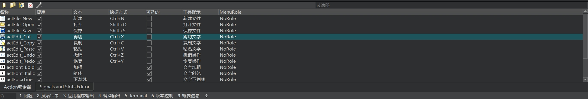

# 第五天

## QAction案例（简易文字编译器）

### Qt Designer制作部分


##### 窗口选择"QApplication"，目的是可以添加最上方的选择框，关于快捷键是“文字+&快捷键”，比如文件就是“文件&F”，这样用户就可以使用快捷键点开文件选项

### QAction编辑器



##### 用户可以选择添加QAction，注意，像UI上面的那些选项不是QPushButton，而是QAction,只需要将QAction拖入工具栏或者顶部栏就可以了

### QAction编辑动作


| 名称      | 作用                                 |
| --------- | ------------------------------------ |
| 文本      | 界面上显示的名字                     |
| 对象名称  | 代码中的对象名称，也就是变量名       |
| 提示      | 用户鼠标放在QAction上时的提示信息    |
| 图标主题  | 未知                                 |
| 图标      | 图标的Icon                           |
| 可复选    | QAction是否允许多选                  |
| 快捷方式  | 无需输入，只需要按对应的快捷键就可以 |
| Menu role | 未知                                 |

### 导入外部资源

##### 在Qt中很多时候我们需要导入图片作为Icon图标或者一些图片资源，文件栏选择new file -> Qt -> Qt Resource File -> 选择资源文件夹 -> 自动生成`qrc`文件


### 代码编写UI

##### 虽然这种拖拽组件的方式生成UI很方便，但是也有很多组件是无法用这种方式生成的，所以我们需要借助代码实现

```c++
	/**
    * 解决中英文界面互斥性
    * 中文和英文按钮虽然可以直接生成，但是这两个按钮并不能做到互斥
    * 我们将这两个QAction加入一个QActionGroup，让他们作为一个组，在组里面，通过setExclusive（true）设置为互斥性
    */
    QActionGroup *actionGroup = new QActionGroup(this);
    actionGroup->addAction(ui->actLang_CN);
    actionGroup->addAction(ui->actLang_EN);
    actionGroup->setExclusive(true);

    // 解决可视化UI无法解决的组件
    QSpinBox *spinFontSize = new QSpinBox(this);
	// 设置最小值
    spinFontSize->setMinimum(5);
	// 设置最大值
    spinFontSize->setMaximum(50);
	// 将spinFontSize的值设置为textEdit的文字大小
    spinFontSize->setValue(ui->textEdit->font().pointSize());
	// 设置spinFontSize的最短宽度
    spinFontSize->setMinimumWidth(50);
	// 把他添加到toolBar里
    ui->toolBar->addWidget(spinFontSize);

	// 	专门用于选择字体的选择框
    QFontComboBox* comboFontBox = new QFontComboBox(this);
    comboFontBox->setMinimumWidth(150);
	// 设置textEdit的字体样式
    comboFontBox->setFont(ui->textEdit->font());
    ui->toolBar->addWidget(comboFontBox);
	
	// 在工具栏此处添加分割线
    ui->toolBar->addSeparator();
	// 添加关闭按钮
    ui->toolBar->addAction(ui->actClose);

    // status bar（底部状态栏，不是工具栏！！！）
    labFile = new QLabel(this);
    labFile->setMinimumHeight(50);
    labFile->setText("文件名:");
    ui->statusBar->addWidget(labFile);
	// 添加进度条
    progressBar = new QProgressBar(this);
    progressBar->setMaximum(50);
    progressBar->setMinimum(5);
	// 进度条的当前数值为textEdit的字体大小
    progressBar->setValue(ui->textEdit->font().pointSize());
    ui->statusBar->addWidget(progressBar);
    labInfo = new QLabel("Permanent");
	// 将labInfo设置为状态栏中永久添加给定的窗口小控件
    ui->statusBar->addPermanentWidget(labInfo);
```

