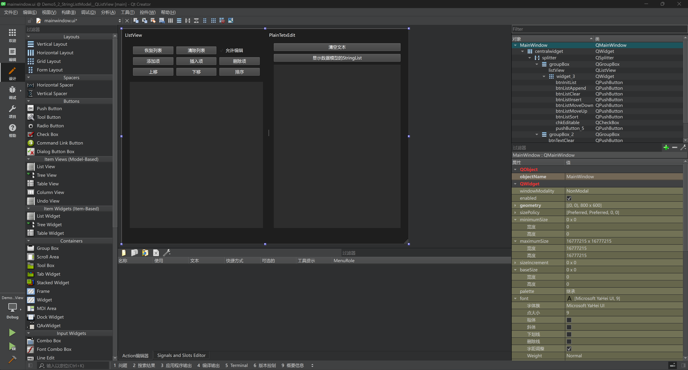
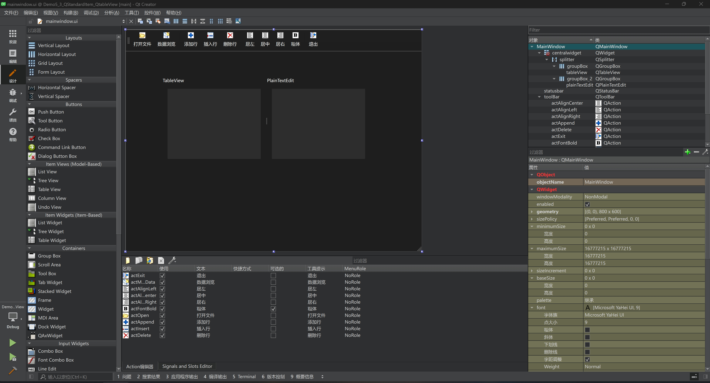
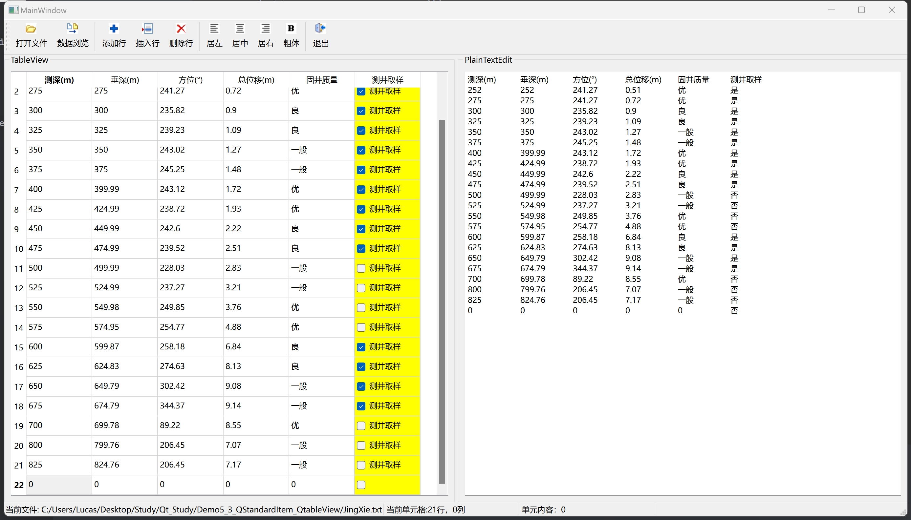

# 第八天

## `stringListModel`和`QListView`

本案例主要是学习`stringListModel`模型的创建和`QListView`的使用

### 界面设计



| 组件名称                   | 功能                                           |
| -------------------------- | ---------------------------------------------- |
| 恢复列表                   | 将`ListView`列表恢复初始化                     |
| 清除列表                   | 将`ListView`列表清空                           |
| 允许编辑                   | 可以双击列表编辑信息                           |
| 添加项                     | 在列表末尾添加新的一行                         |
| 插入项                     | 用户选择要插入的行，在当前位置插入新的一行     |
| 删除项                     | 用户选择删除行的位置，删除当前行               |
| 上移                       | 用户选择当前行，将当前行的位置上移一行         |
| 下移                       | 用户选择当前行，将当前行的位置下移一行         |
| 排序                       | 按照列表字母排序                               |
| 清空文本                   | 将`textLineEdit`的文本信息清除                 |
| 显示数据模型的`stringList` | 将列表的所有内容以文本的形式展现在textLineEdit |

### 代码部分

```c++
// mainwindow.h

#ifndef MAINWINDOW_H
#define MAINWINDOW_H

#include <QMainWindow>
#include <QStringList>
#include <QStringListModel>

QT_BEGIN_NAMESPACE
namespace Ui {
class MainWindow;
}
QT_END_NAMESPACE

class MainWindow : public QMainWindow
{
    Q_OBJECT

private:
    QStringList m_strList;	// 数据源
    QStringListModel *m_model;	// 数据模型

public:
    MainWindow(QWidget *parent = nullptr);
    ~MainWindow();

private slots:
    void on_btnInitList_clicked();

    void on_btnListClear_clicked();

    void on_chkEditable_clicked(bool checked);

    void on_btnListAppend_clicked();

    void on_btnListInsert_clicked();

    void on_btnListMoveUp_clicked();

    void on_btnListMoveDown_clicked();

    void on_btnListSort_clicked(bool checked);

    void on_btnTextClear_clicked();

    void on_btnTextImport_clicked();

    void on_listView_clicked(const QModelIndex &index);

private:
    Ui::MainWindow *ui;
};
#endif // MAINWINDOW_H

```

```c++
// mainwindow.cpp

#include "mainwindow.h"
#include "ui_mainwindow.h"
#include <QStringListModel>

MainWindow::MainWindow(QWidget *parent)
    : QMainWindow(parent)
    , ui(new Ui::MainWindow)
{
    ui->setupUi(this);

    m_strList<<"北京"<<"上海"<<"成都"<<"广州";	// 将城市信息放入m_strList
    m_model = new QStringListModel(this);	// 创建QListViewModel对象
    m_model->setStringList(m_strList);	// m_model使用m_strList作为信息源
    ui->listView->setModel(m_model);	// 将m_model关联到ui界面的listView，listView 将使用 m_model 中的数据来显示列表项。
    ui->listView->setEditTriggers(QAbstractItemView::DoubleClicked | QAbstractItemView::SelectedClicked);	// 当列表项被双击时可以进行编辑；当选中的项被点击时也可以进行编辑

}

MainWindow::~MainWindow()
{
    delete ui;
}

// 初始化列表
void MainWindow::on_btnInitList_clicked()
{
    m_model->setStringList(m_strList);	// 再次规定m_strList作为m_model的数据源
}

// 清除列表
void MainWindow::on_btnListClear_clicked()
{
    /**
    * bool QAbstractItemModel::removeRows(int row, int count, const QModelIndex &parent = QModelIndex());
    * row:要删除的起始行的索引
    * count:要删除的行数
    * const QModelIndex &parent = QModelIndex():可选参数，表示父项的索引，默认是 QModelIndex()，通常在不涉及树形结构时可以忽略。
    * 函数返回bool值
    */
    m_model->removeRows(0, m_model->rowCount());
}

// 允许编辑
void MainWindow::on_chkEditable_clicked(bool checked)
{
    if(checked)
        ui->listView->setEditTriggers(QAbstractItemView::DoubleClicked | QAbstractItemView::SelectedClicked);
    else
        // 若没有勾选，不允许编辑列表
        ui->listView->setEditTriggers(QAbstractItemView::NoEditTriggers);
}

// 添加行
void MainWindow::on_btnListAppend_clicked()
{
     /**
    * bool QAbstractItemModel::insertRows(int row, int count, const QModelIndex &parent = QModelIndex())
    * row:要添加的起始行的索引
    * count:要添加多少行（可选）
    * const QModelIndex &parent = QModelIndex():可选参数，表示父项的索引，默认是 QModelIndex()，通常在不涉及树形结构时可以忽略。
    * 函数返回bool值
    */
    m_model->insertRow(m_model->rowCount());	
    QModelIndex index = m_model->index(m_model->rowCount() - 1);	// 更新列表的索引，需要行数减一，因为索引是从0开始的
    m_model->setData(index, "new item", Qt::DisplayRole);	// m_model在索引为index处添加新的行，设置为new item
    ui->listView->setCurrentIndex(index);	// 将新插入的行设置为当前选中项
}

// 插入行
void MainWindow::on_btnListInsert_clicked()
{
    QModelIndex index = ui->listView->currentIndex();	// 获取用户当前选择的行索引
    m_model->insertRow(index.row());	// 插入的位置
    m_model->setData(index, "new item", Qt::DisplayRole);
    ui->listView->setCurrentIndex(index);
}

// 上移选中行
void MainWindow::on_btnListMoveUp_clicked()
{
    QModelIndex index;	// 定义一个空的 QModelIndex 对象 index。在平面模型（如 QStringListModel）中，我们通常使用空的 QModelIndex 表示根项
    int currentRow = ui->listView->currentIndex().row();	// 获取当前用户选择的行数
    /**
    * bool QAbstractItemModel::moveRow(const QModelIndex &sourceParent, int sourceRow, const QModelIndex &destinationParent, int destinationChild)
    * const QModelIndex &sourceParent：原行的父项索引，对于平面模型，一般为nullptr
    * sourceRow：原位置
    * const QModelIndex &destinationParent：目标行的父项索引，对于平面模型，一般为nullptr
    * destinationChild：目标行的位置
    * 函数返回bool值
    */
    m_model->moveRow(index, currentRow, index, currentRow - 1);
}

// 下移选中项
void MainWindow::on_btnListMoveDown_clicked()
{
    QModelIndex index;
    int currentRow = ui->listView->currentIndex().row();
    m_model->moveRow(index, currentRow, index, currentRow + 2);	// 只有索引+2才能移动到正确的位置，记住就行了
}

// 排序
void MainWindow::on_btnListSort_clicked(bool checked)
{
    if(checked)
        m_model->sort(0, Qt::AscendingOrder);	// 正序
    else
        m_model->sort(0, Qt::DescendingOrder);	// 倒序
}

// 清除文本框
void MainWindow::on_btnTextClear_clicked()
{
    ui->plainTextEdit->clear();
}

// 将列表的信息呈现到文本框
void MainWindow::on_btnTextImport_clicked()
{
    ui->plainTextEdit->clear();
    QStringList tmpList = m_model->stringList();	// 获取m_model的stringList
    for(QString str : tmpList){
        ui->plainTextEdit->appendPlainText(str);	// 将列表每一行的信息作为文本框每一行的信息
    }
}

// 底部操作框，一旦点击列表就会触发此函数
void MainWindow::on_listView_clicked(const QModelIndex &index)
{
    QString str = QString("模型索引:row = %1 column = %2   ").arg(index.row()).arg(index.column());	// 可以通过index获取行和列的信息
    str += m_model->data(index,Qt::DisplayRole).toString();	// 获取操作的对象字符串
    ui->statusbar->showMessage(str);	// 展示底部操作框
}
```

### 最终效果


## `QStandardItem`和`QTableView`

### 界面设计



| 组件     | 功能                                     |
| -------- | ---------------------------------------- |
| 打开文件 | 打开txt文件，并读取里面的内容            |
| 数据浏览 | 将`tableView`的数据呈现到右侧`plainText` |
| 添加行   | 在表格末尾添加新的一行                   |
| 插入行   | 用户选择行，在当前行之前插入新的一行     |
| 删除行   | 用户选择行，删除当前行                   |
| 居左     | 用户选择表格，表格的内容文字左对齐       |
| 居中     | 用户选择表格，表格的内容文字居中         |
| 居右     | 用户选择表格，表格的内容文字右对齐       |
| 粗体     | 用户选择表格，表格的内容文字加粗         |
| 退出     | 退出软件                                 |

### 代码部分

```c++
// mainwindow.h

#ifndef MAINWINDOW_H
#define MAINWINDOW_H

#include <QMainWindow>

class QLabel;
class QStandardItemModel;
class QItemSelectionModel;

QT_BEGIN_NAMESPACE
namespace Ui {
class MainWindow;
}
QT_END_NAMESPACE

class MainWindow : public QMainWindow
{
    Q_OBJECT

private:
    const int FixedColumnCount = 6;	// 表格数据一共有6列
    QLabel *labCurFile;	// 全局变量，用于呈现当前文件名
    QLabel *labCellPos;	// 全局变量，用于呈现当前用户选择的表格位置
    QLabel *labCellText;	// 全局变量，用于呈现当前用户选择的表格内容

    QStandardItemModel *m_model;	// 	数据模型
    QItemSelectionModel *m_selection;	// 管理和追踪视图中选定项的类

    void iniModelData(QStringList &aFileContent);	// 初始化视图，传入字符串集合
private slots:
    void do_currentChanged(const QModelIndex &current, const QModelIndex &previous);

    void on_actOpen_triggered();

    void on_actModelData_triggered();

    void on_actAppend_triggered();

    void on_actInsert_triggered();

    void on_actDelete_triggered();

    void on_actAlignLeft_triggered();

    void on_actAlignCenter_triggered();

    void on_actAlignRight_triggered();

    void on_actFontBold_triggered(bool checked);

public:
    MainWindow(QWidget *parent = nullptr);
    ~MainWindow();

private:
    Ui::MainWindow *ui;
};
#endif // MAINWINDOW_H

```

```c++
// mainwindow.cpp

#include "mainwindow.h"
#include "ui_mainwindow.h"
#include<QLabel>
#include<QItemSelectionModel>
#include<QStandardItemModel>
#include<QFileDialog>

MainWindow::MainWindow(QWidget *parent)
    : QMainWindow(parent)
    , ui(new Ui::MainWindow)
{
    ui->setupUi(this);
    setCentralWidget(ui->splitter);

    labCurFile = new QLabel("当前文件", this);
    labCurFile->setMinimumWidth(200);
    labCellPos = new QLabel("当前单元格", this);
    labCellPos->setMinimumWidth(200);
    labCellText = new QLabel("单元格内容", this);
    labCellText->setMinimumWidth(200);

    // 给底部状态栏添加组件
    ui->statusbar->addWidget(labCurFile);
    ui->statusbar->addWidget(labCellPos);
    ui->statusbar->addWidget(labCellText);

    /** QStandardItemModel::QStandardItemModel(int rows, int columns, QObject *parent = nullptr)
    * 	rows:行数		columns:列数		QObject *parent = nullptr:可选，父类
    */
    m_model = new QStandardItemModel(2, FixedColumnCount, this);
        
    /**	QItemSelectionModel::QItemSelectionModel(QAbstractItemModel *model, QObject *parent)
    *	model: 模型对象		parent:可选，父类
    */    
    m_selection = new QItemSelectionModel(m_model, this);
        
    ui->tableView->setModel(m_model);	// 设置表格视图模型
    ui->tableView->setSelectionModel(m_selection);	// 设置表格视图选择模型
    ui->tableView->setSelectionMode(QAbstractItemView::ExtendedSelection);	// 允许用户通过拖动或点击来选择多个项
    ui->tableView->setSelectionBehavior(QAbstractItemView::SelectItems);	// 当用户进行选择时，选择的是项（而不是单元格或行/列）

    connect(m_selection, &QItemSelectionModel::currentChanged, this, &MainWindow::do_currentChanged);
}

// 用户点击表格，下方状态栏更新
void MainWindow::do_currentChanged(const QModelIndex &current, const QModelIndex &previous){
    if(current.isValid()){
        labCellPos->setText(QString("当前单元格:%1行，%2列").arg(current.row()).arg(current.column()));	// 用户当前点击的单元格位置
        QStandardItem *aItem = m_model->itemFromIndex(current);
        labCellText->setText("单元内容：" + aItem->text());	// 获取单元格的内容
        ui->actFontBold->setChecked(aItem->font().bold());
    }
}

MainWindow::~MainWindow()
{
    delete ui;
}

// 初始化表格数据
void MainWindow::iniModelData(QStringList &aFileContent){
    int rowCount = aFileContent.size();	// 获取文件数据的行数
    m_model->setRowCount(rowCount - 1); // 第一行是标题，所以模型的行数要减一

    QString header = aFileContent.at(0);
    QStringList headerList = header.split(QRegularExpression(R"(\s+)"), Qt::SkipEmptyParts);	// 使用空格作为分隔符将字符串分成多个部分
    m_model->setHorizontalHeaderLabels(headerList);	// 设置为模型的水平表头
    int j;

    QStandardItem *aItem;	// 一个单元表格
    for(int i = 1; i < rowCount; i++){	// 从1开始，因为第一行是表头
        QString aLineText = aFileContent.at(i);
        QStringList tmpList = aLineText.split(QRegularExpression(R"(\s+)"), Qt::SkipEmptyParts);	// 按照空格分开成多个部分
        for(j = 0; j < FixedColumnCount - 1; j++){
            aItem = new QStandardItem(tmpList.at(j));	// 这是每一列的数据
            // void QStandardItemModel::setItem(int row, int column, QStandardItem *item)
            m_model->setItem(i - 1, j, aItem);	// 设置第i-1行，j列的数据为aItem
        }
        aItem = new QStandardItem(headerList.at(j));
        aItem->setCheckable(true);	// 设置允许勾选
        aItem->setBackground(QBrush(Qt::yellow));	// 当前行的背景颜色设置为黄色
        if(tmpList.at(j) == "0"){	// 如果当前单元格的内容是0，不勾选勾选框
            aItem->setCheckState(Qt::Unchecked);
        }
        else{	// 反之勾选
            aItem->setCheckState(Qt::Checked);
        }
        m_model->setItem(i - 1, j, aItem);	// 设置第i-1行，j列的数据为aItem
        // 注意，由于j变量在for循环之外，因此每次到勾选框时，j都等于6
    }
}

// 打开文件
void MainWindow::on_actOpen_triggered()
{
    QString curPath = QCoreApplication::applicationDirPath();	// 获取当前应用程序的目录路径，作为文件对话框的默认打开位置。
    QString aFileName = QFileDialog::getOpenFileName(this, "打开一个文件", curPath, "数据文件(*.txt);;所有文件(*.*)");	// 打开文件的弹窗，[static] QString QFileDialog::getOpenFileName(QWidget *parent = nullptr, const QString &caption = QString(), const QString &dir = QString(), const QString &filter = QString(), QString *selectedFilter = nullptr, QFileDialog::Options options = Options())

    if(aFileName.isEmpty()) return;	// 如果打开的文件是空的，终止函数
    QFile aFile(aFileName);	// 文件名称
    if(!aFile.open(QIODevice::ReadOnly | QIODevice::Text)){	// 尝试以只读和文本模式打开用户选择的文件
        return;
    }

    QStringList aFileContent;	// 用于接收文档信息的集合
    ui->plainTextEdit->clear();	// 先将plainTextEdit清空
    QTextStream aStream(&aFile);	// 创建一个 QTextStream 对象 aStream 来读取文件
    while(!aStream.atEnd()){
        QString str = aStream.readLine();	// 读每一行的数据
        ui->plainTextEdit->appendPlainText(str);	// 将他呈现在文本框中
        aFileContent.append(str);	// 将这个结果存入全局变量，便于后期使用
    }
    aFile.close();

    labCurFile->setText("当前文件: " + aFileName);
    // 当导入文件后，一些组件就可以使用
    ui->actAppend->setEnabled(true);
    ui->actInsert->setEnabled(true);
    ui->actDelete->setEnabled(true);

    iniModelData(aFileContent);	// 调用初始化函数
}

// 将当前表格数据呈现到文本框中
void MainWindow::on_actModelData_triggered()
{
    ui->plainTextEdit->clear();
    QStandardItem *aItem;
    QString str;

    // 将表头内容呈现到文本框中
    for(int i = 0; i < m_model->columnCount(); ++i){
        aItem = m_model->horizontalHeaderItem(i);
        str += aItem->text();
        str += "\t";
    }

    ui->plainTextEdit->appendPlainText(str);

    // 将单元格的内容呈现到文本框中
    for(int i = 0; i < m_model->rowCount(); ++i){
        str = "";
        for(int j = 0; j < m_model->columnCount() - 1; ++j){
            aItem = m_model->item(i, j);	// 获取第i行，j列的单元格
            str += aItem->text();
            str += "\t";
        }
        // 单独处理最后一列的数据
        aItem = m_model->item(i, m_model->columnCount() - 1);
        if(aItem->checkState() == Qt::Checked)	
            str += "是";
        else
            str += "否";

        ui->plainTextEdit->appendPlainText(str);
    }
}

// 添加行
void MainWindow::on_actAppend_triggered()
{
    QList<QStandardItem*> aItemList;	// 用于存放一行每列的单元格
    QStandardItem *aItem;	// 每个单元格
    for(int i = 0; i < m_model->columnCount() - 1; i++){
        aItem = new QStandardItem("0");	// 每个单元格的内容设置为字符串0
        aItemList<<aItem;	// 将单元格存入aItemList
    }
    QString str = m_model->headerData(m_model->columnCount(), Qt::Horizontal).toString();	// 将最后一列的内容设置为当前列表头的内容
    aItem = new QStandardItem(str);
    aItem->setCheckable(true);
    aItem->setBackground(QBrush(Qt::yellow));
    aItemList<<aItem;
    
    /** void QStandardItemModel::insertRow(int row, const QList<QStandardItem *> &items)
    *	row：添加到第几行		items:当前行的所有QStandardItem
    */
    m_model->insertRow(m_model->rowCount(), aItemList);
    m_selection->clearSelection();	// 清除当前的选择
    m_selection->setCurrentIndex(m_model->index(m_model->rowCount() - 1, 0), QItemSelectionModel::Select);	// 获取新插入行的第一个单元格的索引
}

// 插入行
void MainWindow::on_actInsert_triggered()
{
    QList<QStandardItem*> aItemList;
    QStandardItem *aItem;
    for(int i = 0; i < m_model->columnCount() - 1; i++){
        aItem = new QStandardItem("0");
        aItemList<<aItem;
    }
    QString str = m_model->headerData(m_model->columnCount(), Qt::Horizontal).toString();
    aItem = new QStandardItem(str);
    aItem->setCheckable(true);
    aItem->setBackground(QBrush(Qt::yellow));
    aItemList<<aItem;
    QModelIndex curIndex = m_selection->currentIndex();	// 用户选择的单元格索引
    m_model->insertRow(m_selection->currentIndex().row(), aItemList);	// 添加到currentIndex().row()行
    m_selection->clearSelection();
    m_selection->setCurrentIndex(curIndex, QItemSelectionModel::Select);	// 设置当前选择到curIndex的位置
}

// 删除行
void MainWindow::on_actDelete_triggered()
{
    QModelIndex curIndex = m_selection->currentIndex();
    if(curIndex.row() != m_model->rowCount() - 1){	// 如果删除的不是最后一行
        m_model->removeRow(curIndex.row());
        m_selection->setCurrentIndex(curIndex, QItemSelectionModel::Select);	// 更新选择框的位置
    }
    else{
        m_model->removeRow(curIndex.row());
    }
}

// 文字靠左对齐
void MainWindow::on_actAlignLeft_triggered()
{
    if(!m_selection->hasSelection())	// 如果用户没有选择，不进行操作
        return;

    QModelIndexList indexList = m_selection->selectedIndexes();	// 获取用户选择框的索引，因为用户可能会选择多个单元格
    for(auto aIndex : indexList){	// 遍历
        // QStandardItem *QStandardItemModel::itemFromIndex(const QModelIndex &index) const
        // 根据index获取item
        m_model->itemFromIndex(aIndex)->setTextAlignment(Qt::AlignLeft | Qt::AlignVCenter);
    }
}

// 文字居中对齐
void MainWindow::on_actAlignCenter_triggered()
{
    if(!m_selection->hasSelection())
        return;

    QModelIndexList indexList = m_selection->selectedIndexes();
    for(auto aIndex : indexList){
        m_model->itemFromIndex(aIndex)->setTextAlignment(Qt::AlignHCenter | Qt::AlignVCenter);
    }
}

// 文字靠右对齐
void MainWindow::on_actAlignRight_triggered()
{
    if(!m_selection->hasSelection())
        return;

    QModelIndexList indexList = m_selection->selectedIndexes();
    for(auto aIndex : indexList){
        m_model->itemFromIndex(aIndex)->setTextAlignment(Qt::AlignRight | Qt::AlignVCenter);
    }
}

// 文字加粗
void MainWindow::on_actFontBold_triggered(bool checked)
{
    if(!m_selection->hasSelection())
        return;

    QModelIndexList indexList = m_selection->selectedIndexes();
    for(auto aIndex : indexList){
       QFont font = m_model->itemFromIndex(aIndex)->font();	// 获取item的字体
       font.setBold(checked);	// 设置加粗
       m_model->itemFromIndex(aIndex)->setFont(font);
    }
}
```

### 最终效果



