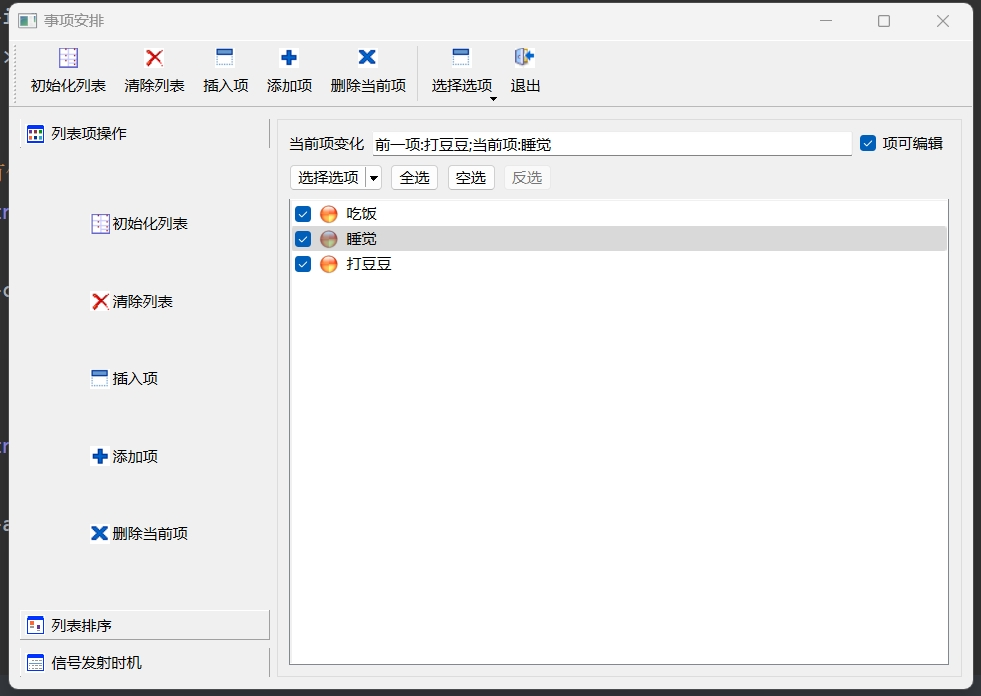

# 第六天

## `QToolButton`案例

##### 本案例是做一个事项列表，可以添加、删除、修改事例


##### 界面上方是一个`toolBar`里面是`QAction`;左边是`toolBox`,里面包含三个`pages`；正中间是`listWidget`，专门用于制作列表

```c++
#include "mainwindow.h"
#include "ui_mainwindow.h"
#include<QMenu>
#include<QListWidgetItem>

MainWindow::MainWindow(QWidget *parent)
    : QMainWindow(parent)
    , ui(new Ui::MainWindow)
{
    ui->setupUi(this);
    // 给toolButton添加默认行为，也就是点击按钮，也算点击QAction
    ui->tBtnListInit->setDefaultAction(ui->actListInit);
    ui->tBtnListAppend->setDefaultAction(ui->actListAppend);
    ui->tBtnListInsert->setDefaultAction(ui->actListInsert);
    ui->tBtnListClear->setDefaultAction(ui->actListClear);
    ui->tBtnListDelete->setDefaultAction(ui->actListDelete);
    ui->tBtnSelectAll->setDefaultAction(ui->actSelAll);
    ui->tBtnSelNone->setDefaultAction(ui->actSelNone);
    ui->tBtnSellnvs->setDefaultAction(ui->actSelInvs);
    
    // 添加QMenu，下面有三个选项
    QMenu* menuSelection = new QMenu(this);
    menuSelection->addAction(ui->actSelAll);
    menuSelection->addAction(ui->actSelInvs);
    menuSelection->addAction(ui->actSelNone);
    
    // 点击工具按钮时，会弹出一个菜单
    ui->tBtnSelectItem->setPopupMode(QToolButton::MenuButtonPopup);
    // menuSelection设置为工具按钮ui->tBtnSelectItem的弹出菜单
    ui->tBtnSelectItem->setMenu(menuSelection);
    
    // 创建一个QToolButton
    QToolButton *aBtn = new QToolButton(this);
    aBtn->setPopupMode(QToolButton::InstantPopup);
    aBtn->setText("选择选项");
    aBtn->setIcon(QIcon(":/images/icons/424.bmp"));
    // 设置弹出菜单方式
    aBtn->setToolButtonStyle(Qt::ToolButtonTextUnderIcon);
    // 将menuSelection设置为弹出菜单
    aBtn->setMenu(menuSelection);
    // 添加aBtn到toolBar中
    ui->toolBar->addWidget(aBtn);
    
    // 添加actQuit QAction到toolBar中
    ui->toolBar->addAction(ui->actQuit);
}

MainWindow::~MainWindow()
{
    delete ui;
}

// 初始化listWidget
void MainWindow::on_actListInit_triggered()
{
    QListWidgetItem *aItem;
    // 先清除listWidget所有的子项
    ui->listWidget->clear();
    QIcon aIcon;
    // 给每个子项前面都放上图标
    aIcon.addFile(":/images/icons/check2.ico");
    // 获取是否可以编辑的选择框的状态
    bool chk = ui->chkBoxListEditable->isChecked();
    // 这里默认初始化10个子项
    for(int i = 0; i < 10; i++){
        aItem = new QListWidgetItem();
        // 默认每个子项取名为第i个
        aItem->setText("Item" + QString::number(i));
        aItem->setIcon(aIcon);
        // 默认让每个子项是已选择的状态
        aItem->setCheckState(Qt::Checked);

        // 如果允许编辑，向他们设置为可编辑状态、可选中状态、可勾选状态、可启用状态
        if(chk){
            aItem->setFlags(Qt::ItemIsEditable|Qt::ItemIsSelectable|Qt::ItemIsUserCheckable|Qt::ItemIsEnabled);
        }
        // 如果不允许编辑，除了不设置可编辑状态，其余均设置
        else{
            aItem->setFlags(Qt::ItemIsSelectable|Qt::ItemIsUserCheckable|Qt::ItemIsEnabled);
        }

        // 将生成的每个子项渲染到listWidget里面
        ui->listWidget->addItem(aItem);

    }
}

// 清除listWidget所有子项
void MainWindow::on_actListClear_triggered()
{
    ui->listWidget->clear();
}

// 选中当前子项，在他前面插入子项
void MainWindow::on_actListInsert_triggered()
{
    // 这里可以简化写法
    QIcon aIcon(":/images/icons/check2.ico");
    bool chk = ui->chkBoxListEditable->isChecked();
    QListWidgetItem* aItem = new QListWidgetItem();
    // 设置插入的子项的文字
    aItem->setText("Item Inserted");
    aItem->setIcon(aIcon);
    aItem->setCheckState(Qt::Checked);

    if(chk){
        aItem->setFlags(Qt::ItemIsEditable|Qt::ItemIsSelectable|Qt::ItemIsUserCheckable|Qt::ItemIsEnabled);
    }
    else{
        aItem->setFlags(Qt::ItemIsSelectable|Qt::ItemIsUserCheckable|Qt::ItemIsEnabled);
    }

    // 调用insertItem函数，传入用户当前选择的行和要插入的QListWidgetItem
    ui->listWidget->insertItem(ui->listWidget->currentRow(), aItem);
}

// 在子项末尾添加子项
void MainWindow::on_actListAppend_triggered()
{
    QIcon aIcon(":/images/icons/check2.ico");
    bool chk = ui->chkBoxListEditable->isChecked();
    QListWidgetItem* aItem = new QListWidgetItem();
    aItem->setText("Item added");
    aItem->setIcon(aIcon);
    aItem->setCheckState(Qt::Checked);

    if(chk){
        aItem->setFlags(Qt::ItemIsEditable|Qt::ItemIsSelectable|Qt::ItemIsUserCheckable|Qt::ItemIsEnabled);
    }
    else{
        aItem->setFlags(Qt::ItemIsSelectable|Qt::ItemIsUserCheckable|Qt::ItemIsEnabled);
    }

    // 默认添加到末尾
    ui->listWidget->addItem(aItem);
}

// 删除当前选择的子项
void MainWindow::on_actListDelete_triggered()
{
    // 获取用户当前选择的子项
    int row = ui->listWidget->currentRow();
    // 调用takeItem函数，传入行数，删除listWidget第row行的QListWidgetItem
    delete ui->listWidget->takeItem(row);
}

// 全选
void MainWindow::on_actSelAll_triggered()
{
    // 统计listWidget子项的个数
    int cnt = ui->listWidget->count();
    QListWidgetItem * aItem = new QListWidgetItem;
    for(int i = 0; i < cnt; i++){
        // listWidget的第i个子项
        aItem = ui->listWidget->item(i);
        // 给当前子项设置为选中状态
        aItem->setCheckState(Qt::Checked);
    }
}

// 全不选
void MainWindow::on_actSelNone_triggered()
{
    int cnt = ui->listWidget->count();
    QListWidgetItem * aItem = new QListWidgetItem();
    for(int i = 0; i < cnt; i++){
        aItem = ui->listWidget->item(i);
        // 设置为不选
        aItem->setCheckState(Qt::Unchecked);
    }
}

// 反选
void MainWindow::on_actSelInvs_triggered()
{
    int cnt = ui->listWidget->count();
    QListWidgetItem * aItem = new QListWidgetItem();
    for(int i = 0; i < cnt; i++){
        aItem = ui->listWidget->item(i);
        // 如果当前子项是选中状态
        if(aItem->checkState() == Qt::Checked)
            // 设置为不选中状态
            aItem->setCheckState(Qt::Unchecked);
        // 反之
        else
            aItem->setCheckState(Qt::Checked);
    }
}

// 
void MainWindow::on_listWidget_currentItemChanged(QListWidgetItem *current, QListWidgetItem *previous)
{
    QString str;
    // 如果当前项不为空，也就是用户选择了某个子项
    if(current != nullptr){
        // 如果用户没有选择过某个子项，是第一次选择子项
        if(previous == nullptr){
            str = "当前项" + current->text();
        }
        // 反之
        else{
            str = "前一项:" + previous->text() + ";当前项:" + current->text();
        }
        // 让这些信息在editCutItemText显示
        ui->editCutItemText->setText(str);
    }
    // 调用函数就在plainTextEdit追加信息
    ui->plainTextEdit->appendPlainText("currentItemChaned()信号被发射");
}

// 给listWidget设置是否允许排序
void MainWindow::on_checkBox_Sorting_clicked(bool checked)
{
    ui->listWidget->setSortingEnabled(checked);
}


// 升序排序
void MainWindow::on_tBtnSortAsc_clicked()
{
    // 先判断
    if(ui->listWidget->isSortingEnabled())
        ui->listWidget->sortItems(Qt::AscendingOrder);
}

// 降序排序
void MainWindow::on_tBtnSortDes_clicked()
{
    // 先判断
    if(ui->listWidget->isSortingEnabled())
        ui->listWidget->sortItems(Qt::DescendingOrder);
}

// 清除plainTextEdit所有信息
void MainWindow::on_tBtnClearText_clicked()
{
    ui->plainTextEdit->clear();
}

// 点击添加行
void MainWindow::on_tBtnAddLine_clicked()
{
    ui->plainTextEdit->appendPlainText(" ");
}


```

##### 软件最终效果

