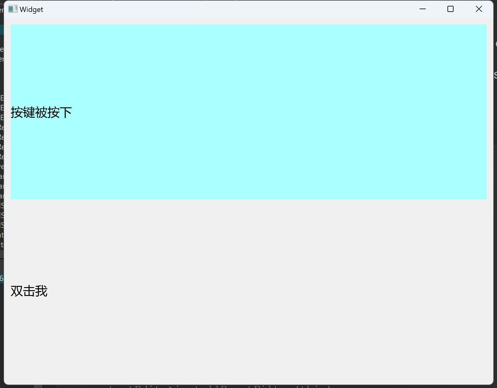
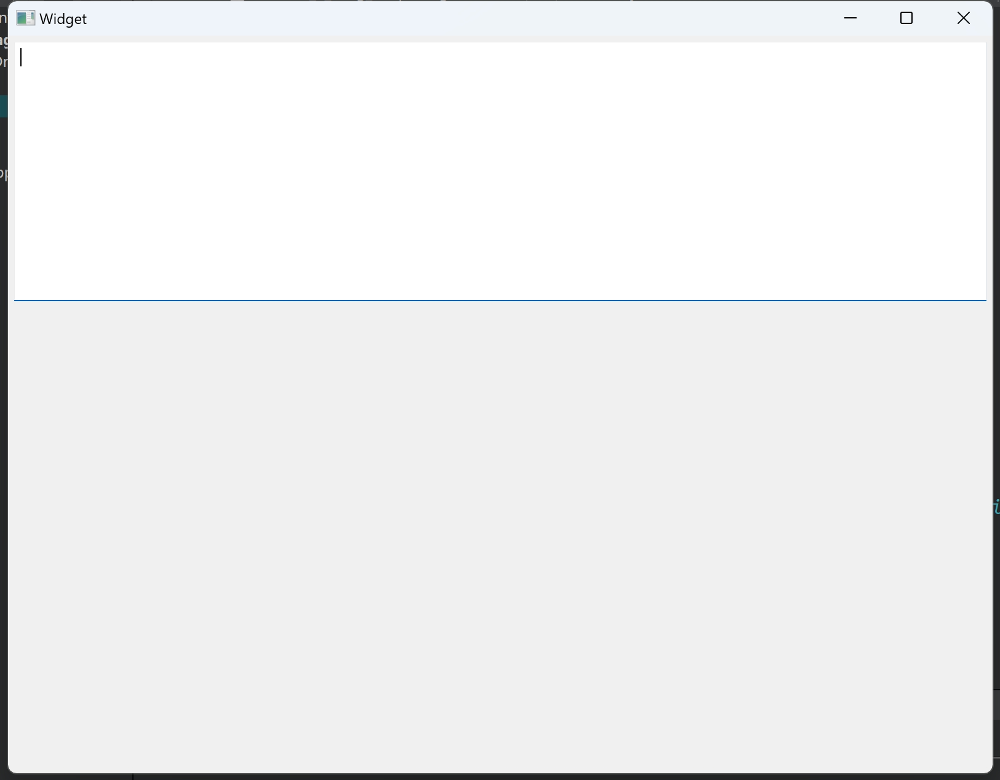
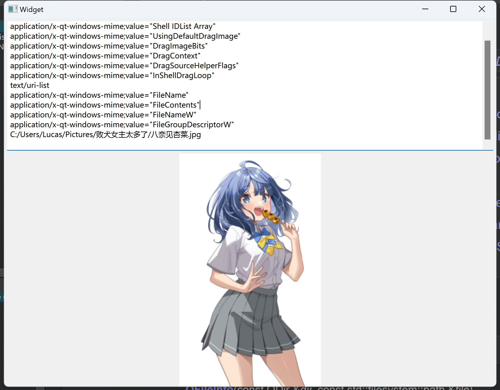

# 第十天

## 事件过滤

主要是一些触发事件的编写，本案例是鼠标单击于双击事件，并且鼠标单击还包括按下按键和抬起按键

### 代码部分

```c++
// widget.h

#ifndef WIDGET_H
#define WIDGET_H

#include <QWidget>

QT_BEGIN_NAMESPACE
namespace Ui {
class Widget;
}
QT_END_NAMESPACE

class Widget : public QWidget
{
    Q_OBJECT

public:
    Widget(QWidget *parent = nullptr);
    ~Widget();

private:
    Ui::Widget *ui;

    // QObject interface
public:
    virtual bool eventFilter(QObject *watched, QEvent *event) override;	// 重载eventFilter函数
};


#endif // WIDGET_H

```

```c++
// widget.cpp

#include "widget.h"
#include "ui_widget.h"

Widget::Widget(QWidget *parent)
    : QWidget(parent)
    , ui(new Ui::Widget)
{
    ui->setupUi(this);
    ui->labSC->installEventFilter(this);
    ui->labDC->installEventFilter(this);
}

Widget::~Widget()
{
    delete ui;
}

bool Widget::eventFilter(QObject *watched, QEvent *event)
{	
    if(watched == ui->labSC){	// 	接收对象
        if(event->type() == QEvent::Enter){	// 事件触发类型是鼠标进入区域
            ui->labSC->setStyleSheet("background-color:rgb(170,255,255);");
        }
        else if(event->type() == QEvent::Leave)	// 鼠标离开区域
        {
            ui->labSC->setText("单击我");
            ui->labSC->setStyleSheet("");
        }
        else if(event->type() == QEvent::MouseButtonPress){
            ui->labSC->setText("按键被按下");
        }
        else if(event->type() == QEvent::MouseButtonRelease){
            ui->labSC->setText("按键被抬起");
        }
    }

	// 处理鼠标双击事件
    if(watched == ui->labDC){
        if(event->type() == QEvent::Enter){
            ui->labDC->setStyleSheet("background-color:rgb(85,255,127);");
        }
        else if(event->type() == QEvent::Leave)
        {
            ui->labDC->setText("双击我");
            ui->labDC->setStyleSheet("");
        }
        else if(event->type() == QEvent::MouseButtonDblClick){
            ui->labDC->setText("按键被双击按下");
        }
    }
    return QWidget::eventFilter(watched, event);	// 由于必须要返回布尔值，将这个方法递归返回
}

```

### 最终效果



## 拖拽事件

### 界面设计



界面上方是`plainTextEdit`文本框，用于显示图片信息，下方是`label`标签，用于显示图片；用户可以将`.jpg`的图片通过拖拽的方式拖进界面，并会在`label`标签上显示，上方的文本框会显示相应的事件信息和路径

### 代码部分

```c++
// widget.h

#ifndef WIDGET_H
#define WIDGET_H

#include <QWidget>

QT_BEGIN_NAMESPACE
namespace Ui {
class Widget;
}
QT_END_NAMESPACE

class Widget : public QWidget
{
    Q_OBJECT

public:
    Widget(QWidget *parent = nullptr);
    ~Widget();

private:
    Ui::Widget *ui;
    QPixmap orginPix;

    // QWidget interface
protected:
    // 重构界面重绘、拖拽和释放事件
    virtual void resizeEvent(QResizeEvent *event) override;
    virtual void dragEnterEvent(QDragEnterEvent *event) override;
    virtual void dropEvent(QDropEvent *event) override;
};


#endif // WIDGET_H

```

```c++
// widget.cpp

#include "widget.h"
#include "ui_widget.h"
#include <QMimeData>
#include <QFileInfo>

Widget::Widget(QWidget *parent)
    : QWidget(parent)
    , ui(new Ui::Widget)
{
    ui->setupUi(this);
    setAcceptDrops(true);	// 接受释放事件
    // 文本框和标签不接受此事件，为了避免在这些组件上出现不必要的拖放行为
    ui->plainTextEdit->setAcceptDrops(false);	
    ui->label->setAcceptDrops(false);

}

Widget::~Widget()
{
    delete ui;
}

// 当界面（大小）发生变化时会调用此函数
void Widget::resizeEvent(QResizeEvent *event)
{
    QSize sz = ui->plainTextEdit->size();	// 获取文本框组件的尺寸
    ui->plainTextEdit->move(5, 5);	// 将它移动到坐标为（5， 5）的位置
    ui->label->move(5, sz.height() + 10);
    ui->plainTextEdit->resize(this->width() - 10, sz.height());	// 文本框的宽度是widget的宽度-10px，高度是自身原本的高度
    ui->label->resize(this->width() - 10, this->height() - sz.height() - 10);	// 宽度与上面一致，高度是界面高度减文本框
    QPixmap scalePixmap = orginPix.scaledToHeight(ui->label->height(), Qt::SmoothTransformation);	// 动态渲染图片尺寸
    ui->label->setPixmap(scalePixmap);
    event->accept();
}

void Widget::dragEnterEvent(QDragEnterEvent *event)
{
    // 呈现拖拽图片的Qt信息和路径
    ui->plainTextEdit->clear();
    ui->plainTextEdit->appendPlainText("dragEnterEvent事件，mimeData的format:");
    for(auto &item : event->mimeData()->formats())
    {
        ui->plainTextEdit->appendPlainText(item);
    }
    for(auto &item : event->mimeData()->urls())
    {
        ui->plainTextEdit->appendPlainText(item.path().right(item.path().length() - 1));
    }

	// 如果拖拽过来的东西有URL地址（一般都有）
    if(event->mimeData()->hasUrls())
    {
        QString fileName = event->mimeData()->urls().at(0).fileName();	// 截取正确的路径地址，主要是/C:/use最前面的/
        QFileInfo fileInfo(fileName); // 获取文件的目录详细地址
        QString ex = fileInfo.suffix().toUpper();
        if(ex == "JPG")
            event->acceptProposedAction();  // 我们接受这个东西进来
        else
            event->ignore();
    }
    else
        event->ignore();
}

void Widget::dropEvent(QDropEvent *event)
{
    QString fullPath = event->mimeData()->urls().at(0).path();
    fullPath = fullPath.right(fullPath.length() - 1);
    QPixmap pixmap(fullPath);	// 得到了地址就可以显示图像
    orginPix = pixmap;
    pixmap = pixmap.scaledToHeight(ui->label->height(), Qt::SmoothTransformation);
    ui->label->setPixmap(pixmap);
    event->accept();	
}

```

### 最终效果

