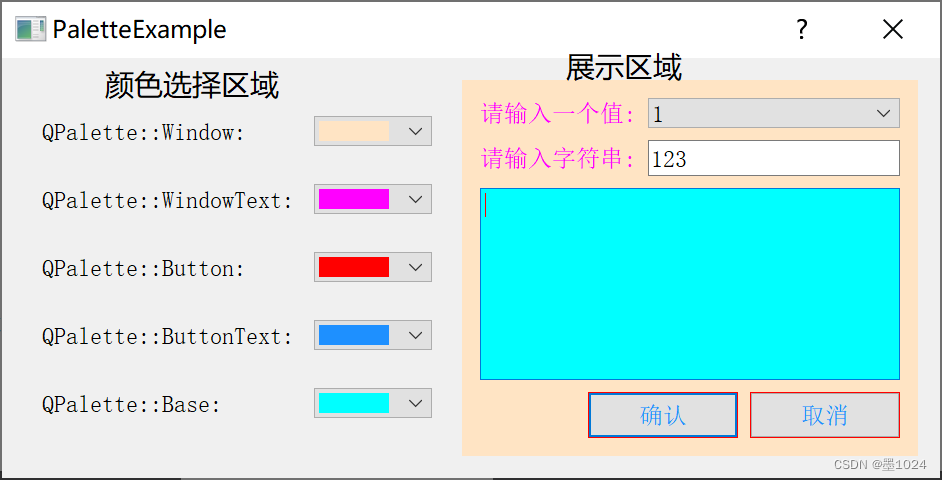

# 第四天

##### 学习如何直接使用代码进行UI绘制

##### 最终效果


##### 点击上方的字体选项可以立即改变输入框的字体演示，选择框支持多选；下方颜色选择框允许切换不同颜色，颜色选择框只能单选；点击确认、取消、退出按钮均可以退出程序

#### `dialog.h`头文件

##### 所有具有槽函数的组件我们都定义为私有成员变量，且需要在`dialog.h`头文件先声明，所有的组件我们都定义为指针变量

##### `QCheckBox`是多选框，`QRadioButton`是单选框，虽然`QRadioButton`也可以通过方法实现多选效果，但我们还是推荐遵循这样的规则；对于`QCheckedBox`单选框我们可以通过`isChecked`函数判断当前框是否选上

##### `QPlainTextEdit`是一个用于编辑和显示纯文本的小部件。它经过优化，可以处理大型文档并对用户输入做出快速响应。这个组件包含太多功能，详细可以在[QPlainTextEdit](https://blog.csdn.net/kenfan1647/article/details/127686781)查看

##### 自定义四个槽函数用于处理信号

```c++
#ifndef DIALOG_H
#define DIALOG_H

#include <QDialog>
#include<QCheckBox>
#include<QRadioButton>
#include<QPushButton>
#include<QPlainTextEdit>


QT_BEGIN_NAMESPACE
namespace Ui {
class Dialog;
}
QT_END_NAMESPACE

class Dialog : public QDialog
{
    Q_OBJECT

public:
    Dialog(QWidget *parent = nullptr);
    ~Dialog();

private:
    Ui::Dialog *ui;
    QCheckBox *chkBoxUnder;
    QCheckBox *chkBoxItalic;
    QCheckBox *chkBoxBold;
    QRadioButton *radioBlack;
    QRadioButton *radioBlue;
    QRadioButton *radioRed;
    QPushButton *btnOK;
    QPushButton *btnCancel;
    QPushButton *btnClose;
    QPlainTextEdit *txtEdit;
    // 绘制UI函数
    void iniUI();
    // 封装信号和槽函数
    void iniSignalSlots();

private slots:
    // 使字体变成Under
    void do_chkBoxUnder(bool checked);
    // 使字体变成Italic
    void do_chkBoxItalic(bool checked);
    // 使字体变成Bold
    void do_chkBoxBold(bool checkded);
    // 设置字体颜色
    void do_setFontColor();
};
#endif // DIALOG_H

```

#### `dialog.cpp`

##### `iniUI()`函数用于绘制程序图形界面

##### `QHBoxLayout`是一个布局管理类，用于管理组件的水平布局，用于在水平方向上自动调整和布局子部件的位置和大小，通过`addWidget`函数添加组件

##### `QVBoxLayout`也是布局管理器，管理组件的垂直布局，自动排布竖直方向上的组件位置和大小

##### `addStretch`可以理解为在组件中间添加弹簧，如果不加这个，在`QHBoxLayout`布局中组件会平分布局空间，如下图所示


##### `addStretch()`内不添加数字表示弹簧会占用剩余所有空间，其余组件会被压缩至最小大小

##### 如果有两个及以上的`addStretch()`并设置了大小，剩余空间会按比例分配

```c++
    HLay3 -> addWidget(btnOK);
    HLay3 -> addStretch(1);
    HLay3 -> addWidget(btnCancel);
    HLay3 -> addStretch(2);
    HLay3 -> addWidget(btnClose);
```


```c++
void Dialog::iniUI(){
    chkBoxUnder = new QCheckBox("Underline");
    chkBoxItalic = new QCheckBox("Italic");
    chkBoxBold = new QCheckBox("Bold");
    QHBoxLayout *HLay1 = new QHBoxLayout();
    HLay1 -> addWidget(chkBoxUnder);
    HLay1 -> addWidget(chkBoxItalic);
    HLay1 -> addWidget(chkBoxBold);

    // 创建Black、Red、Blue3个单选按钮，并水平布局
    radioBlack = new QRadioButton("Black");
    // 默认选择黑色
    radioBlack -> setChecked(true);
    radioRed = new QRadioButton("Red");
    radioRed -> setChecked(false);
    radioBlue = new QRadioButton("Blue");
    radioBlue -> setChecked(false);
    QHBoxLayout *HLay2 = new QHBoxLayout;
    HLay2 -> addWidget(radioBlack);
    HLay2 -> addWidget(radioRed);
    HLay2 -> addWidget(radioBlue);

    // 创建确定，取消退出3个按钮，并水平布局
    btnOK = new QPushButton("确定");
    btnCancel = new QPushButton("取消");
    btnClose = new QPushButton("退出");
    QHBoxLayout *HLay3 = new QHBoxLayout;
    HLay3 -> addWidget(btnOK);
    HLay3 -> addWidget(btnCancel);
    HLay3 -> addStretch();
    HLay3 -> addWidget(btnClose);

    // 创建文本框，并设置初始字体
    txtEdit = new QPlainTextEdit();
    txtEdit -> setPlainText("Hello World\n手工创建");
    QFont font = txtEdit -> font();
    // 设置字体大小为20px
    font.setPointSize(20);
    txtEdit -> setFont(font);

    // 创建垂直布局，并设置为主布局
    QVBoxLayout *VLay = new QVBoxLayout(this);
    VLay -> addLayout(HLay1);
    VLay -> addLayout(HLay2);
    VLay -> addWidget(txtEdit);
    VLay -> addLayout(HLay3);
    
    // 整个父组件设置为垂直布局
    setLayout(VLay);

}
```

#### 四个槽函数

##### 对于字体样式，先获取到`txtEdit`内的字体，再通过`setUnderline`设置字体样式，因为函数会传入布尔值，勾选框是true，也就是会调用`font.setUnderline(checked);`这行代码，反之不勾选不调用

##### `QPalette`专门用于管理对话框的外观显示。每个控件或者窗体都包含一个`QPalette`对象，在显示时会根据其`QPalette`对象中对各个部分各状态下的颜色的描述进行绘制；声明`txtEdit`的`palette`，先判断单选框是否勾选，然后再设置文本框里面的颜色为指定颜色



```c++
void Dialog::do_chkBoxUnder(bool checked){
    // UnderLine复选框
    QFont font = txtEdit -> font();
    font.setUnderline(checked);
    txtEdit -> setFont(font);
}

void Dialog::do_chkBoxItalic(bool checked){
    // Italic复选框
    QFont font = txtEdit -> font();
    font.setItalic(checked);
    txtEdit -> setFont(font);
}

void Dialog::do_chkBoxBold(bool checked){
    // Bold复选框
    QFont font = txtEdit -> font();
    font.setBold(checked);
    txtEdit -> setFont(font);
}

void Dialog::do_setFontColor(){
    // 设置文字颜色
    QPalette plet = txtEdit -> palette();
    if(radioBlack -> isChecked())
        plet.setColor(QPalette::Text, Qt::black);
    if(radioBlue -> isChecked())
        plet.setColor(QPalette::Text, Qt::blue);
    if(radioRed -> isChecked())
        plet.setColor(QPalette::Text, Qt::red);

    txtEdit->setPalette(plet);
}
```

#### 信号与槽

##### 这个此前解释过多次，这里不再解释，不过如果有参数只需给出数据类型，不需要给出参数；

##### 注意！槽函数无法直接传参，唯一的方法是使用Lambda表达式，Lambda表达式之前讲解过，这里不做阐述

```c++
void Dialog::iniSignalSlots(){
    // 设置3个字体复选框
    connect(chkBoxUnder, SIGNAL(clicked(bool)), this, SLOT(do_chkBoxUnder(bool)));
    connect(chkBoxItalic, SIGNAL(clicked(bool)), this, SLOT(do_chkBoxItalic(bool)));
    connect(chkBoxBold, SIGNAL(clicked(bool)), this, SLOT(do_chkBoxBold(bool)));

    // 3个颜色的单选按钮
    connect(radioBlack, SIGNAL(clicked(bool)), this, SLOT(do_setFontColor()));
    connect(radioBlue, SIGNAL(clicked(bool)), this, SLOT(do_setFontColor()));
    connect(radioRed, SIGNAL(clicked(bool)), this, SLOT(do_setFontColor()));

    // 3个按钮与窗口的槽函数关联
    connect(btnOK, SIGNAL(clicked(bool)), this, SLOT(accept()));
    connect(btnCancel, SIGNAL(clicked(bool)), this, SLOT(reject()));
    connect(btnClose, SIGNAL(clicked(bool)), this, SLOT(close()));

}
```

#### 调用函数

```c++
Dialog::Dialog(QWidget *parent)
    : QDialog(parent)
    , ui(new Ui::Dialog)
{
    ui->setupUi(this);

    iniUI();
    iniSignalSlots();
    setWindowTitle("手动创建UI");

}
```

